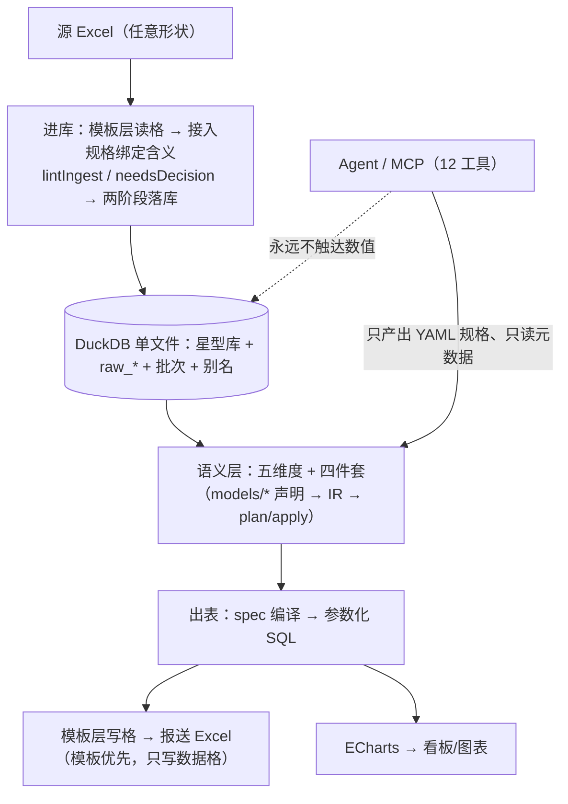

# bi-lite 需求与架构

> 状态：两层架构定稿（v2，本文是唯一规范文本）
> 定位：开源、轻量的本地 BI 引擎 —— CLI / MCP / Web 三个入口，共用同一套引擎

---

## 0. 一句话定位

**bi-lite 是一台开源、轻量的本地 BI 引擎：一份 Excel 加一份 YAML 规格，就地建库、按模板出表。**

数据不交给任何服务：引擎跑在自己的机器上，唯一的数据可信源是本地那个 DuckDB 文件。

**两个方向**，都由 YAML 驱动：

| 方向 | 输入 | 规格（YAML） | 产出 |
|---|---|---|---|
| **进库** | 任意形状的 Excel（长表、集团一张表、子公司报表…） | **接入规格** | 本地星型库（维度 + 事实，DuckDB） |
| **出表** | 库里的数 | **报表规格** | 按模板渲染的报送 Excel / ECharts 图表 |

**三个入口，同一套引擎**：

| 入口 | 给谁用 | 怎么用 |
|---|---|---|
| **CLI** | 人与脚本 | `bilite …`（`bin` → `src/cli.ts`：`ingest lint\|dry-run\|run` · `render` · `query` · `catalog dump\|show` · `compact` · `plan` / `apply` · `validate` · `skill export`） |
| **MCP + skill** | agent | agent 与用户对话，把规格探明、敲定，再落库出表（§7） |
| **Web** | 人 | 浏览器三个页签：数据导入 → 看板查询 → 报表报送 |

**核心抽象只有一个**：`spec` —— 声明式规格（YAML）。接入规格说"这份 Excel 怎么读"，
报表规格说"这张表按什么口径算、填进哪张模板"。

**它不是 BI 看板**：数据只在进库环节进入一次，此后所有工作都是把已入库的数据按不同口径重新排布；
出表是主战场，看板是同一份 spec 的另一个 renderer。

**整个引擎分两层（§8 是本文的总纲）**：
**模板层**只答两问 —— 数在哪一格、格的本体含义是什么；
**语义层**用五个维度组织信息（§8.2）。进库与出表在模板层对偶、在执行上不对偶。

---

## 1. 背景与痛点

用户所在集团每月从财务平台导出 Excel 长表（按 财务期月份 × 公司名称 × 指标名称 组织），随后需要：

- **保送工作**：把财务数据按**不同接收方给定的表格形式**重新排布成 Excel 报送
- **经营分析**：查询某公司/某指标的数据，按不同口径生成图表用于汇报

| # | 痛点 | 病根 |
|---|---|---|
| P1 | 填表靠人工从导出 Excel 抄到目标表格，容易出错 | 数据与排版焊死在同一个文件里 |
| P2 | 目标表格口径经常更换 | 排版规则没有被抽象成可参数化的东西 |
| P3 | 财务数据敏感，不能进入 LLM 上下文 | 缺少 agent 与 DB 之间的隔离层 |

P1 和 P2 是同一个病根的两个症状：**没有把"数据"与"排版"分离**。P3 决定了 agent 的接入方式必须是"只碰结构、不碰数值"。

---

## 2. 需求

### 2.1 功能需求

| ID | 需求 | 优先级 |
|---|---|---|
| F1 | 从**任意形状**的 Excel 导入财务数据（按**接入规格 YAML** 读取），作为**唯一数据可信源** | P0 |
| F2 | 导入运营类数据（合同、业务线等），与财务数据共享公司/期间维度 | P1 |
| F3 | 用声明式规格（spec）描述一张报送表的行/列/口径/取值，并能参数化换月份、换口径 | P0 |
| F4 | 按 spec 渲染出 Excel，**保留原模板版式、样式、公式** | P0 |
| F5 | 按同一份 spec 渲染出图表（ECharts） | P1 |
| F6 | Web 端可按公司/指标/月份便捷查询 | P1 |
| F7 | agent 作为规格录入入口：从 Excel 模板或自然语言产出 spec 草稿 | P2 |
| F8 | spec 定稿后入库，成为可复用的命名报表 | P1 |
| F9 | 导入时本地校验（唯一性、勾稽、空值、未识别主数据） | P1 |

### 2.2 非功能需求

| ID | 需求 | 说明 |
|---|---|---|
| N1 | 轻量 | Node + DuckDB，**单进程单文件、零外部服务、零构建步骤** |
| N2 | 安全 | 财务明细不以明文进入 LLM 上下文 |
| N3 | 本地优先 | 数据不出本机；导入完全在 Web 手工触发 |
| N4 | 可追溯 | 数据可追到导入批次；重述历史可查 |
| N5 | 单机可用 | 不做多用户并发、不做集群 |

### 2.3 明确不做（Non-goals）

- ❌ 复杂图表编辑器 —— 精细排版交给 Office / Univer 生态
- ❌ 定时调度、告警、订阅推送
- ❌ 多租户、SSO、细粒度用户管理
- ❌ 对接外部数仓 / 实时数据流
- ❌ Agent 自主执行 SQL

---

## 3. 技术选型

| 层 | 选型 | 理由 |
|---|---|---|
| 运行时 | Node.js（≥ 22.6，原生跑 `.ts`，无构建步骤） | 单进程，无额外服务 |
| 明细存储 | **DuckDB + Parquet** | 列存，交叉聚合毫秒级；单文件 |
| 元数据存储 | **DuckDB 内表**（`_meta_*` / `_model*` / `raw_*` / `import_batch` / `dim_alias`） | 与明细同一个库文件，量小但需事务（SQLite 路线从未引入，见 §4.5） |
| DuckDB 绑定 | `@duckdb/node-api`（**版本锁死，不用 `^`**） | 官方新绑定；1.3.3 曾被投毒（CVE-2025-59037），浮动版本有供应链风险 |
| Excel 读写 | **xlsx-populate**（模板填充主选） | 见 §5.3：exceljs 对真实模板读入即崩、写出静默删部件，已排除 |
| 前端 | 原生 JS + ECharts，零框架零构建 | 需求简单，不引入重框架 |
| 后端 | Node 原生 HTTP | 与 N1 一致 |
| MCP | **手写零依赖 stdio 服务端** | 官方 SDK 16MB（zod 占 8MB），而实际协议面只有 4 个方法；e2e 用真实客户端 SDK 钉住握手（§3.2） |

**不选**：FastAPI/Python（双进程）、Metabase/Superset（太重）、纯内存（无法作可信源）。

### 3.1 关键约束

#### 3.1.1 DuckDB 单写者锁：实测矩阵

| 场景 | 结果 |
|---|---|
| 同进程同 instance 多连接：读 / 写 | ✅ / ✅ |
| 同进程另建 instance（rw）/ READ_ONLY | ✅ / ✅ |
| **跨进程第二个 writer** | ❌ |
| **跨进程第二个 READ_ONLY** | ❌ **同样拒绝** |
| 无写者时 3 个并发 READ_ONLY | ✅ |

**关键结论**：官方那句 "multiple processes can read" **只在没有任何写者时成立**。
所以采用**单进程独占一个 `.duckdb` 文件、进程内双连接**（导入与查询互不阻塞，MVCC 保证）；
三个入口（Web / MCP / CLI）都是「薄壳 + 自己开库」，互斥由这把锁天然强制，被占用时**明确报错、不静默失败**（§4.4）。

#### 3.1.2 其他约束

- **口径是列，不是行。** `period_type` 是 `fact_finance` 的字段，不塞进 `metric_id`。
- **账面累计必须实存。** 含审计调整，不能从单月派生。
- **必须锁死 `@duckdb/node-api` 版本**，不用 `^`（供应链）。
- 该绑定不支持 UDF/UDT 与 windows_arm64，需要自定义函数要提前评估。

### 3.2 MCP 协议：手写而非引 SDK

实测握手序列为 `initialize` → `notifications/initialized` → `tools/list` → `tools/call`，
换行分隔的 JSON-RPC 2.0（**stdout 是协议通道，日志一律走 stderr**）。两条必须记住的协议细节：

| 细节 | 要求 | 不这么做的后果 |
|---|---|---|
| `server/discover` | **必须回一个 JSON-RPC 错误**（本实现回 `-32601`） | 沉默不答会让探测窗口**超时**，而不是回落 legacy |
| `initialize` 的版本 | 回**客户端请求的版本**（若在已知列表内） | 版本不匹配可能被客户端拒绝 |

漂移风险不靠"照文档实现"对冲：**e2e 用 DSH 自带的真实 MCP 客户端 SDK 连本服务**，协议若漂，验收先红。

---

## 4. 数据模型与落盘

采用 Kimball 星型模型：维度共享，事实表按业务域拆分。

> ★ 业务表（`dim_*` / `fact_*`）的 DDL **不由人手写**：唯一真相是 `models/*.yml` 的声明，
> `bilite plan` 出 diff、`bilite apply` 落地，`_meta_columns` 是那份声明的**投影**（§8.2 / `src/gen/`）。
> 下面两段是**那份声明的语义**（粒度、口径是列、共享维度），不是 DDL 载体。

### 4.1 维度表

```sql
-- 公司维度：有层级（parent_id 自引用，集团→子公司多层树），支撑"按板块汇总"
CREATE TABLE dim_company (
  id VARCHAR PRIMARY KEY, name VARCHAR NOT NULL,
  parent_id VARCHAR, level INTEGER, group_name VARCHAR,
  alias VARCHAR[]              -- 导入时识别到的别名
);

-- 指标维度
CREATE TABLE dim_metric (
  id VARCHAR PRIMARY KEY, name VARCHAR NOT NULL,
  category VARCHAR, unit VARCHAR, direction VARCHAR,
  alias VARCHAR[]
);

-- 期间维度：财务期与自然月可能不一致
CREATE TABLE dim_period (
  fin_month DATE PRIMARY KEY, year INTEGER, month INTEGER, is_audited BOOLEAN
);
```

**维度版本行（SCD2 类型 2）挂在侧表**：`dim_company_hist` / `dim_metric_hist`
（主键 `(id, valid_from)`，区间半开 `[valid_from, valid_to)`）。`dim_company` / `dim_metric`
仍是当前态的唯一真相 —— 既有查询与 spec 编译一个字都不用改（把版本行塞进维表本身，
每一处 join 都得补 `is_current`，少写一处数字就翻倍）。改属性走 `setDimAttributes()`，
两份表示由 `scdProblems()` 对拍；生效日一律用**期的首日**（重放要确定性）。

### 4.2 事实表

```sql
-- 财务事实：三维交点 × 口径
CREATE TABLE fact_finance (
  fin_month DATE NOT NULL, company_id VARCHAR NOT NULL,
  metric_id VARCHAR NOT NULL, period_type VARCHAR NOT NULL,
  amount DECIMAL(18,2), batch_id VARCHAR,
  PRIMARY KEY (fin_month, company_id, metric_id, period_type)
);

-- 运营事实独立成表，共享 dim_company / dim_period；量纲、频率、口径体系都不同，不塞进 fact_finance
CREATE TABLE fact_business_line (
  fin_month DATE NOT NULL, company_id VARCHAR NOT NULL, metric_id VARCHAR NOT NULL,
  business_line VARCHAR NOT NULL,          -- 行内携带的退化列，进主键
  amount DECIMAL(18,2), batch_id VARCHAR,
  PRIMARY KEY (fin_month, company_id, metric_id, business_line)
);
-- ★ 注意它**没有 period_type**：运营指标没有财务那套口径体系。
--   它由 models/fact_business_line.yml 声明生成；接入规格的 `target:` 由声明校验（§8.2）。
```

### 4.2.1 聚合表（`kind: aggregate`）：派生物，删了能回来

```yaml
# models/agg_finance_by_month.yml —— 聚合表不写列，列由跨表投影
kind: aggregate
source: fact_finance          # 必须是本目录声明的事实表
grain: [fin_month, metric_id, period_type]   # 聚合键；不在键里的维度被加总
measures:
  - { name: amount, agg: sum }                # v1 只认 sum
```

聚合表是**派生物**，不是又一份数据：写路径只有一条 —— `CREATE OR REPLACE TABLE AS SELECT
… GROUP BY` 全量重算（DuckDB 没有物化视图，「删了能回来」就是重建语义）。落库时与数据
**同一事务**重建；`bilite rebuild` 随时手动重算；`plan` 对它只比列名集合，不一致就是
非阻塞的 rebuild-table。

两条硬规则（`src/gen/parse.ts` 解析期拒绝）：

- **口径与期数不许被聚合掉**（`MODEL_AGG_NONADDABLE`）：把「本年累计」与「单月」加在一起，
  是错得最安静的那一种 —— 报表数字看着完全正常。这是铁律 8（口径是列）前移到解析期。
- **grain 与源表粒度相同** → `MODEL_AGG_NOOP`：一行都没被加总，这不是聚合，是复制。

### 4.2.2 维度声明行与桥接表：多对多摊分（`kind: bridge` + `via:`）

小维表与多对多映射直接写进 `models/*.yml`（**git 即审计**，行数到万级再换 Excel，替换不叠加）：

```yaml
# models/dim_business_line.yml —— 声明行：写路径只有 bilite rebuild 全量对齐
kind: dimension
rows:
  - { name: 工业 }
  - { name: 消费 }
# models/map_org_bl.yml —— 桥接表：公司 × 业务线摊分，外键写名字
kind: bridge
rows:
  - { company: 集团公司, business_line: 工业, weight: 1.0 }
  - { company: 华东子公司, business_line: 工业, weight: 0.6 }
  - { company: 华东子公司, business_line: 消费, weight: 0.4 }
# models/agg_finance_by_business.yml —— 聚合穿桥：按权重摊分
kind: aggregate
source: fact_finance
via: map_org_bl
grain: [fin_month, bl_id, metric_id, period_type]
measures:
  - { name: amount, agg: sum }
```

写路径只有一条：`bilite rebuild` 同一事务里 DELETE→INSERT 全量对齐（维先桥后），
维行 id = `nameHash(name)` 派生（**不手写**）；桥接行外键写名字、落库时解析成 id，
错名整批拒绝（绝不静默建主数据）。三条硬规则（`src/gen/parse.ts` / `src/gen/sync.ts`）：

- **带 rows 的维不许被 fact 引用**（`MODEL_ROWS_OWNER_BAD`）：接入归并与 rebuild
  全量对齐是两条互删的写路径，一张表只能归一个。
- **每公司权重和必须 =1**（sync 期 SQL 十进制精确校验）：摊分要么完整、要么整个不摊；
  权重和 ≠1 整批回滚，一行都不写。
- **聚合 `via:` 穿桥 = `SUM(amount × weight)` 加权摊分**，join 键自动推导（源表与桥接表
  引用同一张维表的那一对，恰一对否则 `MODEL_AGG_VIA_BAD`）；grain 必须留桥坐标，
  否则结果行无法回溯到业务线。守恒对拍：按已映射公司过滤后，Σ摊分 = Σ明细。

### 4.3 导入批次（可追溯）

`import_batch`（batch_id / source_file / row_count / imported_at / status / note）。
查询默认取最新批次但保留历史：财务数据会重述，报送被质疑时要能说清用的是哪一版。

### 4.4 落盘策略：单进程独占 DuckDB

**采用**：一个 `.duckdb` 文件，**单进程独占**，导入和查询用同进程内的不同连接（MVCC 让读不被写阻塞）。
Parquet 只作**归档层**（备份与溯源：`data/parquet/<table>/batch=<id>/part.parquet`），不是并发手段。

**唯一需要遵守的纪律**：同一时刻只有一个进程持有 `.duckdb`。三个入口都是「薄壳 + 自己开库」，
互斥由单写者锁天然强制；被占用时明确报错并提示改用已在运行的入口。

> CLI 是短命进程（用完即退），不构成第二个常驻进程；服务端在跑时它拿不到锁，**明确报错**即可。

#### 4.4.1 归档必须绕开主实例的硬化（实测）

主实例开着 `enable_external_access=false`（安全硬化），而 `COPY ... TO` 属外部文件操作会被直接拒 ——
**硬化与归档在同一个实例上根本互斥**（`allowed_directories` 三条组合全部实测走不通，且它不拦截 `read_text`，不能当安全边界）。

**采用解法**（`src/db/index.ts` 的 `exportParquet()`）：每次归档**新建**一个短命只读实例
（`READ_ONLY` + `enable_external_access: 'true'`）执行 `COPY` → 写完在**同一个实例**上 `read_parquet` 数一遍
（对不上就抛错、`archived` 置 false）→ `finally` 里 **`reattach()`** 把主实例关掉重开、把锁拿回来。

三条实测性质：只读实例写不了主库；主实例硬化不受影响；**关掉只读实例会把主实例的库锁一起丢掉**
（后果是两个写者同开 → 归档读到过期视图 → 0 行 Parquet 而 `archived` 还报 true ——
所以 `archived: true` 不等于"归档里有数"，必须有读回校验）。
对照：`src/db/compact.ts` 的归档合并开 `:memory:` 实例 —— **不碰库文件、也不碰库锁**，
要碰库文件才需要上面那套舞蹈。

小文件堆积的处置（R8，已落地）：`bilite compact` 只按文件大小挑候选（≥2 个才动手）、
**先逐 batch_id 对拍、再删源文件**；0 行残骸不动它、单独报出来并退 1。

### 4.5 ~~SQLite~~（未采用）

SQLite 路线从未引入，元数据全在 DuckDB 内表（`_meta_*` / `_model*` / `raw_*` / `import_batch` / `dim_alias`）。无残留。

### 4.6 导入流程（接入规格 + 两阶段落库）

```
上传源 Excel（只落盘）→ lint（静态诊断，一次给全）→ dry-run（形状 + 主数据判定，不写库）
  → 有歧义？返回 needsDecision（HTTP 200，一行不写）→ 人拍板（decisions）
  → run（关卡 0 先着陆 raw → 关卡 1/2 校验 → 两阶段落库，同一事务）→ Parquet 归档
```

判据位置见 §8.3；公式注入防护（导出侧）：以 `= + - @` 开头的字符串加 `'` 前缀（`quoteFormulas()`），
防的是导出文件在别人机器上执行公式。

---

## 5. 核心抽象：口径规格（spec）

### 5.1 设计原则

**spec 是"透视表的声明式版本"。** 它是数据与排版之间的唯一中间层，也是 bi-lite 的领域语言——人和 agent 都写它。

一份 spec = 若干 block。每个 block 描述：
`anchor`（写到目标表格的哪个位置，优先用定义名称）· `rows` / `cols`（行/列绑定哪个维度 + 过滤与排序，**换口径只改 cols 这一行**）· `value`（度量 + 聚合 + 显示格式）· `scope`（可参数化的时间/公司等）。

### 5.2 示例与派生指标

```yaml
id: 集团月度保送表
template: templates/月度保送表.xlsx
# fact: fact_finance             # 缺省即 fact_finance；运营报表写 fact: fact_business_line
params: { year: 2026, month: 6 }
sheets:
  - name: 主要指标
    blocks:
      - anchor: B4
        rows:
          dim: metric
          filter: { category: 主要指标 }
          order: [营业收入, 利润总额, ...]
        cols:
          dim: period_type              # ← 换口径只改这里
          order: [本年累计, 去年同期累计, 单月, 单月同比]
        value:
          measure: amount
          agg: sum
          format: "#,##0.00"            # 同时管 Excel 单元格格式与看板显示
        scope:
          time: { year: "{{year}}", month: "{{month}}" }
```

派生表达式：`value.expr`（如 `(本年累计 - 去年同期累计) / 去年同期累计`）由 `src/spec/expr.ts`
的**手写求值器**计算（**不是 eval**）：SQL 出 expr 的输入、JS 算输出。

**目标表 `fact`（可选，缺省 `fact_finance`）**：查询侧与接入侧对偶 —— 接入规格的 `target:`
决定写进哪张表（§4.2），报表规格的 `fact:` 决定从哪张表读。表名必须已在 `models/*.yml`
声明过（kind: fact），compile/query 编译期硬校验、lint 报 `FACT_UNKNOWN`；维在目标表上的
可用性由 `dimAvailableOn()` 判（无口径列的表拒 `period_type` 轴与口径参数，运营表也有指标维、
metric 照旧必须钉住）。**`fact` 是标识符不做模板** —— 不进 `substitutableStrings`，不写 `{{params}}`。

### 5.3 渲染器：模板填充保真

**一个 spec，两个 renderer**：Excel（报送表）与 Chart（ECharts 配置）。
Excel 渲染是决定成败的一环——导出的表还要人工调格式，整个方案就白做了。

**选型结论（本机实测，过程记录见 tech-research 文档）**：

| 方案 | 结论 |
|---|---|
| **xlsx-populate 1.21.0** | ✅ **主选**。"just manipulates the XML data" —— 图表/图片/批注/公式全保，`<extLst>` 逐字节相同 |
| 自打 xlsx XML 补丁（JSZip 定向替换 `<c>` 节点） | ✅ **兜底**，保真最高（9/9 外来部件全保） |
| openpyxl | ❌ 静默删掉所有 x14 扩展，不值得引 Python 子进程 |
| **exceljs 4.4.0** | ❌ **排除**：对真实模板**读入即崩**（硬编码正则匹配不到 openpyxl/Excel 写的部件名）；即使读入成功，写出也会**静默删除** 9 个外来部件中的 8 个（图表/图片/VBA/透视表…），不报错 |

**用法要点**：定位锚点用 `Workbook.definedName(name)`（返回**已解析好的 Cell 对象**，不存在时返回 `undefined`）；
`Sheet.cell()` 只接受 `"B4"` 或 `(row, col)`。

**必须提前决定的坑**：

| # | 坑 | 应对 |
|---|---|---|
| 1 | xlsx-populate **不重算公式、不写回缓存值** | 下游要直接读公式数值时需自打补丁或服务端计算 |
| 2 | 共享/数组公式：往从属格写值会破坏公式链 | 解析阶段识别 `<f t="shared">` 并绕开 |
| 3 | 合并单元格只能往左上角写 | 合并区归一化到锚点 |
| 4 | 自打补丁重打包必须带 `[Content_Types].xml` | 否则文件损坏 |
| 5 | **`cell.style('numberFormat')` 的"读"有副作用**（内部 `createStyle()`，实测仅读 20 格就让 `styles.xml` 2839B→7947B） | **读数字格式走 `readNumberFormat()`**：`styleSheet()._cellXfsNode.children[styleId].attributes.numFmtId` → `getNumberFormatCode(id)`，纯只读 |
| 6 | **spec 的 `format` 会覆盖模板设计**（模板的负数标红格式会丢） | **模板优先**：该格已是显式格式（非 General）就保留，只在 General 格上套用 spec 的 format |

**保真实测（e2e 第 6 阶段固化为回归）**：含图表/图片/批注/公式/条件格式/数据验证/冻结窗格/定义名称/合并的模板，填充后
zip 部件 18→18、图表与图片**逐字节相同**、功能元素无一丢失；10 个被重写的部件全是良性序列化差异
（属性顺序/空白/转义）。⚠️ 若报送下游有电子签章/哈希校验/按字节归档，需提前确认（R11）。

### 5.4 把 spec 编译成 SQL

spec 在服务端编译成**参数化 SQL**，在 DuckDB 内执行；agent 从不接触 SQL。

```
spec (YAML) ──编译──→ parameterized SQL ──执行──→ cell matrix ──填充──→ Excel
                                        └──→ ECharts option
```

---

## 6. 安全设计

### 6.1 威胁模型

主要风险不是"数据库被攻破"，而是**财务明细通过聚合值被反推**：agent 若可自由查询，
可逐个维度组合查询，拼凑出单月明细。

### 6.2 四层防护

| 层 | 措施 |
|---|---|
| ① 能力边界 | agent **没有 SQL 权**。只暴露 12 个 MCP 工具（§7.1），无 shell |
| ② 语义层做桥梁 | agent 拿的是**坐标而非数值**（`preview_spec` 根本不查库） |
| ③ 查询下推 | spec 服务端编译执行；自由问答走 `query_metrics`，`group_by` 只接受已注册维度 |
| ④ 输出脱敏 + 审计 | agent 侧金额返分档值；`render_report` 只回文件路径；审计只记字段名不记值 |

#### 6.2.1 阈值是「受众」的属性，不是「查询」的属性

| 受众 | 谁在用 | 金额 | 每格明细行数下限 | 行数上限 |
|---|---|---|---|---|
| `human` | Web 看板，已授权的财务人员 | **精确值** | 0（不设限） | 5000 |
| `agent` | LLM / MCP | **分档值**（`12.3亿`） | **3** | 200 |

**判据必须是"每格背后的明细行数"，不是"单元格个数"**（后者让 20 格 × 每格 1 行明细的探测式查询蒙混过关）。
SQL 为每个度量列并出 `count(CASE WHEN <cond> THEN 1 END) AS n{i}`，取非空格支撑数的最小值 `minSupport`，
`< 3` 拒答。阈值 3：累计类口径每格 ≥ 6 行，「单月 × 单指标 × 单公司」恰好 = 1 行 —— 挡住后者、不误伤看板。

**受众视角由服务端按入口判定**：Web 入口（`src/server.ts`）固定 `audience='human'` 并**无条件覆盖**请求体里的
`audience` 字段 —— 让前端决定受众等于把安全边界交给能构造任意 HTTP 请求的一方。

> **与主流开源 BI 的路线分歧（自觉的，不是抄来的）**：Lightdash / Metabase / Superset 三家的 MCP 都暴露原始 SQL
> 再加闸门；bi-lite **根本不给 SQL 权**。后者适合财务数据不出本地进程的硬约束。

### 6.3 核心原则

> **agent 产出规格，不产出数据。**
> 流经它的永远是"结构"和"指令"，不是"金额"。

推论：改口径这个核心动作只需要 spec 的 diff，不需要数值参与。"财务数据不进上下文"不是靠过滤实现的，
而是**架构上自然达成**——数值第一次出现在人的浏览器预览里，而不是 LLM 上下文里。

### 6.4 静态加密现状（实测）

DuckDB v1.4.0+ 有原生加密，但：① 只能经 SQL 开启（`ATTACH ... ENCRYPTION_KEY`）；
② **不满足官方 NIST 要求**（duckdb#20162）。因此：**文件系统级加密是基线，原生加密作第二层**，
库文件放在不会被云同步的目录。

---

## 7. Agent 集成

### 7.1 MCP 工具集（仅此十二个）

**看现状（1 个）**：

| 工具 | 作用 | 是否返回数值 |
|---|---|---|
| `get_catalog` | 库里现在有什么：L1 业务成员 / L2 物理结构 / L3 版本，传 `object` 按需下钻 | 否（连格里的值都不查） |

**出表侧（7 个）**：

| 工具 | 作用 | 是否返回数值 |
|---|---|---|
| `list_metrics` | 列出已注册指标/维度/口径 | 否 |
| `get_template_schema` | 解析模板结构，返回锚点与表头布局 | 否（模板里的数字也不回传） |
| `lint_spec` | 静态诊断 spec：欠约束/表达式/join 等结构问题 | 否（不查库） |
| `preview_spec` | 返回 spec 将填充的坐标网格 | **否，且本工具不查库** |
| `render_report` | 执行渲染，返回文件路径 | 否（仅路径与计数） |
| `diff_report` | 比较两版 spec 的差异 | 否 |
| `generate_spec` | 从模板推断 spec 草稿（§7.2 路径 1） | 否（不查库） |

**进库侧（4 个）**：

| 工具 | 作用 | 是否返回数值 |
|---|---|---|
| `look_at_source` | 源的文本视图：表头/行标签文本、哪些格是数字（只报 `{num:true}`）、哪些行带公式 | 否 |
| `lint_ingest` | 静态诊断接入规格（判据同 `lintIngest`，§8.3） | 否（连源文件都不读） |
| `dry_run_ingest` | 干跑：形状 + 主数据判定 | 否（一行都不落库） |
| `run_ingest` | 真正落库；名字有歧义时**整批拒绝、一行不写**并回传要拍板的清单 | 否 |

**实现位置**：`src/mcp/tools.ts`（工具面 + 金额兜底 + 审计）、`src/mcp/server.ts`（零依赖 stdio，§3.2）。
给 agent 的物料是 `skills/bi-lite-ingest/` 下两份：`SKILL.md`（操作手册）与 `AGENT-PROMPT.md`（接线 + system prompt），
两份都由 e2e 拿实现里的工具面对拍（`skillProblems()`，`src/skill/export.ts`）—— 手写的规则一定会漂，所以它必须可检测。

#### 7.1.1 `generate_spec`：推断器是提案者，不是决策者

- 每个轴带 `source`（`template` = 读到的 / `guessed` = 猜的）与 `evidence`（判断依据）；"猜的"单独列出供人核对，
  **不许把猜出来的东西标成读到的**。
- **判维要求全部标签命中**某维度，不许"半数像就算"；**公式行先排除、再判维**（首版顺序反了导致「合计」行匹配失败）。
- 生成的草稿固定带 `scope.time`（§11.2）；模板里没有指标信息时**自报家门**
  （`draftValid: false` + error 级 issue），刻意**不**注入占位 filter —— 那会让 spec 重新"合法"而数字全空。
- 与 `preview_spec` 一样**不查数据库** —— 只读模板结构与注册表，"不含金额"是结构保证。

#### 7.1.2 机械兜底：金额形状的数字一律拦截

`callTool()` 对每个返回值递归扫描，出现 **≥ 10000 的数字**即判定泄漏：记审计 + 打 stderr + 返回错误。
`AMOUNT_TRIPWIRE = 10_000` 的依据：所有工具返回的结构性数字（行数/列数/年份）都远小于它。
这道兜底**不替代结构性设计**（§7.1.1），它防的是"将来某次改动不小心把数值带进返回值"，
把**安静的泄漏**变成**响亮的报错**；已知局限：分档串与真正的低额金额过不了它，所以是第四道防线。

#### 7.1.3 审计日志记字段名，不记值

每次调用写一行 JSONL 到 `data/audit/mcp.jsonl`，只记工具名、参数名与返回值**字段名**、耗时、成败。
**记值就等于把金额写进另一个明文文件**，那会让安全设计自我否定。

### 7.2 三条输入路径，同一个产物

1. **现有模板** → `generate_spec` 推断 rows/cols/value，产出 spec 草稿
2. **自然语言** → agent 产出 spec 草稿
3. **人工直选** → Web 上直接编辑（不用 agent）

#### 7.2.1 ★ 路径 2 的前置条件不是提示词，是让 spec 语言在解析期就挡住欠约束

**只要 spec 语言允许欠约束的写法，写的人（无论人还是 agent）迟早会写出来，而提示词既挡不住也测不了。**
所以路径 2 真正的工程量在 spec 语言本身（`src/spec/{dims,expr,lint}.ts`），实测确认的三个"静默算错"：

| # | 症状 | 根因 | 修法 |
|---|---|---|---|
| A | `rows: company / cols: period_type` 无指标约束 → 五个指标的金额被**加成一个数**（67283 ≠ 真值 65198） | 没有规则要求"量纲维"被钉住 | `lint.ts`：`metric` 与 `period_type` 必须被钉住，否则**解析即拒绝** |
| B | `value.expr` 写了却不算，静默返回原始累计额 | 编译器从不读 `expr` | `expr.ts` 手写求值器 + `runCompiled()` |
| C | `scope.company.filter` 引用 `dim_company` 却不建 JOIN | join 集合只遍历两个轴 | `needJoin` 补上 filter 引用的维度 |

**为什么是"解析即拒绝"而不是"警告"**：财务场景下**静默算错比拒绝出表危险得多** ——
错数字同量级、格式正常，人不会怀疑；表出不来，人一定会来查。

**★ 判据只有一份**：结构诊断全部来自 `lintSpec()`，`parseSpec`、`lint_spec`、`/api/specs/lint`、Web 面板用的都是它
（e2e 断言 `lintSpec 判定「可保存」⇔ parseSpec 不抛`）。两份判据一定会漂移 ——
"工具说没问题、保存却被拒"是最难查的那类 bug。诊断必须**一次给全所有问题**（`diagnoseSpec()`），
不能"改一条、再撞下一条"。

### 7.3 交互风格

**agent 是副驾驶**：能看懂上下文、提出修改建议，**最终确认权在人手里**。

---

## 8. 两层架构（总纲）

引擎只有两层：**模板层**管"形"，**语义层**管"义"。两层各自的职责、判据与对偶关系如下；
§8.4 说明哪些地方**刻意不对偶**。

### 8.1 模板层：只答两问

模板层不懂数钱，它只回答两个问题：

1. **数在哪一格** —— 出表侧由 spec 的 `anchor` + `rows/cols` 网格展开成坐标（`planOf()` 只给坐标不含金额）；
   进库侧由接入规格的 `keys[]` / `values` 列号定位行键与值格。
2. **格的本体含义** —— 这一格是"哪家公司、哪个指标、哪个期、哪个口径"：
   出表侧是行列标签到维度取值的绑定（`rows.dim` / `cols.dim` + `order`）；
   进库侧是 `keys[].as` 到维度/退化列的绑定。

**进库与出表在模板层对偶**：

| | 出表（render） | 进库（ingest） |
|---|---|---|
| 输入 | 报表规格 spec + 空模板 | 接入规格 + 源文件 |
| 数在哪一格 | 算出来 → 写进 | 读出来 → 落库 |
| 本体含义 | 格 → 维度取值（写出前必须钉住） | 格 → 维度取值（读入后必须钉住） |

**Excel / CSV 只是外部形式差异**：格网与绑定关系不变，变的只是读取/写出的介质。
判据不因外部形式分叉 —— 换一种介质不产生第二份判据。

**公共子集已有唯一的家**：`src/spec/geometry.ts`（`TemplateGeometry`）。它只装几何与维度角色
（anchor、行键、值格列、跳过列、dims），**不含实例字面量**（order 清单、filter 值、drop 标签、口径名
—— 那些留在各自的 overlay：报表侧 value/scope/chart，接入侧 values 的口径映射/facts/drop），
也**不含 source** —— source 是执行参数，不是模板的一部分。两个 block 类型都 extends 各自的几何子集；
**锚点判据只有一份**（`lintAnchorGeometry`，`lintSpec` 与 `lintIngest` 都调它）；
"该用哪份判据"的顶层判别（`bilite validate`）也按几何判（`looksLikeIngestDoc`：接入块的 rows 是
「列 → 维」数组，报表块是带 dim 的轴对象），**不再按"有没有 source"判**。

**source 是执行参数**：同一份模板几何可以对任何形状相同的源跑。执行时三处给：
CLI `--source`、MCP `dry_run_ingest`/`run_ingest` 的 `source` 参数、HTTP dry-run/run 的 `source` 字段、
Web 向导"选文件"（请求体带 source，**不改写 YAML 文本**）。旧 YAML 里的 `source:` 照样兼容读 ——
它就是这份规格的默认源；两边都不给 → 执行期报 `SOURCE_MISSING`（静态诊断不拦，那时源还没选）。
报表侧的 `params` 同理：执行参数（CLI `--param`、MCP/HTTP 的 `params`）永远覆盖 YAML 里的默认值。

### 8.2 语义层：五个维度组织信息

**五个维度**（`src/spec/dims.ts` 的 `DIMENSIONS` 是唯一注册表，**能进 SQL 的标识符只有这五个**）：
`metric` · `company` · `period_type` · `month` · `year`。
其中 **`metric` 与 `period_type` 是量纲维**（决定"这个数是什么"，必须被钉住）；
公司/时间是筛选维（只是"哪些数加进来"，可留空）。这份角色判断也只在 `dims.ts` 一处。

每个维度由**四件套**组织：

| 件 | 是什么 | 判据位置 |
|---|---|---|
| **概念** | 这张表/这组维度是什么：`models/*.yml` 声明（表、列、主键、角色）—— 它是语义层的**声明子集** | `src/gen/ir.ts`（IR 是声明的唯一投影；`plan` / `apply` 不动，仍是声明 → DDL 的唯一通路；结构变更一律要人点一次 `bilite apply`） |
| **实例** | 当前态的行：`dim_company` / `dim_metric` 等维表 + `alias` | `src/ingest/master.ts`（主数据快照的唯一实现） |
| **版本** | 历史侧表 `dim_*_hist`（SCD2，半开区间） | `src/db/scd2.ts`（`setDimAttributes` / `dimAsOf` / `scdProblems`） |
| **判据** | 欠约束、口径未注册、expr 引用、join 缺失 | `src/spec/lint.ts`（出表方向唯一判据，§8.3） |

主数据归并的判据在 `src/ingest/resolve.ts`（两档：Tier 1 纯格式噪音自动归并且留痕；
Tier 2 只给候选带 `why`，由人拍板；有歧义 `needsDecision`、一行不写）。
**立场：合并两家公司比不合并危险得多** —— 不合并数字明显不对，人会来查；错合并报表看起来完全正常，没人会来查。

### 8.3 校验与模板正交：天然是两个模块

校验不挂在模板层或语义层任何一侧，它按**方向**分两个模块、两份判据：

| 模块 | 验什么 | code 全集 |
|---|---|---|
| **导入验文件**（`src/ingest/types.ts` 的 `lintIngest()`；dry-run / run / `lint_ingest` / CLI `validate` 共用） | 文件与规格对不对得上 | `HEADER_UNMAPPED` · `PERIOD_UNPARSEABLE` · `COORD_MISSING` · `PERIODTYPE_UNKNOWN`；主数据歧义 → `needsDecision`（HTTP 200，**待办不是失败**） |
| **导出验模板**（`src/spec/lint.ts` 的 `lintSpec()`；`parseSpec` / `lint_spec` / HTTP / Web 共用） | spec 对模板自身的欠约束 | `UNCONSTRAINED_DIM` · `PERIODTYPE_UNKNOWN` · `EXPR_REFS` |

**各自方向内唯一判据**：出表方向不许在 `lintSpec` 之外另写一份；进库方向不许在 `lintIngest` 之外另写一份。
两份判据彼此独立是**设计**，不是重复 —— 它们验的东西不同（文件形状 vs 规格自洽），
合并成一份只会让两个方向互相污染。

### 8.4 执行不对偶（刻意的不对称）

进库与出表在**执行**上不是镜像，不要按对称思路加功能：

| 不对称 | 为什么 |
|---|---|
| **聚合丢信息** | 出表是多行事实 → 一格（SUM），不可逆；进库是一格 → 一行事实。所以出表侧的预览只给坐标（`planOf()`），进库侧的干跑只给形状与计数 |
| **一写一读** | 出表**只写数据格**：模板已显式设过的数字格式/样式/合并/公式/批注/图表一律不动（铁律 3）；进库**只读不清洗**：清洗/换算不许往回写 raw，raw 是 append-only 的可重放唯一依据 |
| **主数据单向** | 进库归并**写** `dim_alias`（别名永久生效，所以两阶段落库、有歧义一行不写）；出表只**读**注册表，不产生主数据 |

### 8.5 模板不 portable；复用单位是未来的 profile

模板绑定具体格网（合并区、行列次序、定义名称），**不跨组织/跨期间移植** —— 可复用的不是模板，
而是"一组模板 + 一份语义快照"的绑定关系。**复用单位是未来的 profile**：

> profile = 语义快照 + 模板集合 + 版本钉，**不含事实数据**。

**现在只留扩展点，不实现**：语义快照的雏形已经存在 —— `catalogDump()`（`src/meta/catalog.ts`）
三层导出与 `masterCatalog()`（`src/ingest/master.ts`）都是零金额的现状导出；profile 落地时应以它们为底，
**不新增取数出口**。在 profile 真正落地前，不引入任何"模板包/配置包"格式，也不做模板间的差异合并。

---

## 9. 架构总览与目录



```
bi-lite/
├── docs/  models/  specs/  templates/  ingest/   # 声明与规格 YAML（可版本化）；data/ 是真实数据，永不提交
└── src/
    ├── gen/      # models/*.yml → IR → plan / apply / rebuild（业务表 DDL 由声明长出来；聚合表全量重算）
    ├── land/     # 着陆层：源 → raw_file/raw_cell（append-only，"可重放"的唯一依据）
    ├── ingest/   # 接入层：lintIngest / dryrun / run / resolve / master
    ├── spec/     # spec 解析 → dims/expr/lint → compile → SQL
    ├── db/       # schema、单进程双连接、exportParquet、SCD2、compact
    ├── semantic/ # queryMetrics（受众分级、反推防护）——唯一的自由查询出口
    ├── render/   # excel（模板填充）/ chart（ECharts）
    ├── meta/     # 列契约（META = 声明的投影）与 catalog 三层导出
    ├── mcp/      # 12 工具 + 金额兜底 + 审计；零依赖 stdio 服务端
    ├── skill/    # 手册可对拍部分：skillFacts / skillProblems
    ├── cli.ts    # 命令行入口（退出码即结论；query 受众写死 human）
    ├── server.ts # Web 入口（零框架；audience 固定 human 并覆盖请求体同名字段）
    └── web/      # 零框架前端（页面不写判据，只把服务端结论摆给人看）
```

> 目录与现状有出入时以 `AGENTS.md` §5 架构地图为准。

---

## 10. 需求追踪矩阵

| 需求 | 章节 | 关键实现 | 验收 |
|---|---|---|---|
| F1 导入 | §4.6, §8.1 | 接入规格 → raw 着陆 → 两阶段落库 | 全链路 e2e 绿；长表 960 行 300ms 级 |
| F2 运营数据 | §4.2 | 独立事实表（`target:` 由声明决定） | 数只进目标表；重放逐行一致 |
| F3 spec | §5 | rows/cols/value 透视语言 | 同一份数据按两种口径出两张表 |
| F4 Excel 渲染 | §5.3 | xlsx-populate 只写数据格 | 版式保真断言（第 6 阶段） |
| F5 图表 | §5.3 | 同一 spec → ECharts；`chartShape()` 给 agent 的形状不含数据点 | 换口径图表跟随 |
| F6 Web 查询 | §6.2 | `queryMetrics` 服务端下推 + 受众分级 | 任意公司任意指标毫秒级 |
| F7 agent 入口 | §7 | 12 个 MCP 工具 | 真实客户端 e2e；全程无金额进上下文 |
| F8 命名报表 | §5.2 | spec 存 specs/*.yaml，参数化复用 | 换月份只改 params |
| F9 导入校验 | §8.3 | `lintIngest` + 主数据两档归并 | 有歧义一行不写 |
| N2 安全 | §6 | 无 SQL 权、坐标不给值 | 金额兜底 + 审计断言 |

---

## 11. 已知风险与坑（结论）

| # | 风险 | 结论 |
|---|---|---|
| R1 | **主数据对齐**：公司/指标名写法每月会变 | ✅ 两档归并 + `dim_alias`；Tier 1 纯格式噪音自动归并留痕，Tier 2 只给候选带 `why` 由人拍板。不做则三个月后数据全是孤儿行。判据细节：`stemCompany()` 不把纯壳名剥空；"写法相近"必须首字相同（字号对上就直接返回，有强信号就不要弱信号）；落库分两阶段（干跑一次库都不写；先建维度再登记别名，别名永久生效） |
| R2 | **历史留痕**：财务数据会重述 | `batch_id` + 保留历史；SCD2 挂侧表（§4.1） |
| R3 | **DuckDB 单写者** | ✅ 单进程独占 + 进程内双连接（§3.1.1 / §4.4） |
| R4 | **模板版式被破坏** | ✅ exceljs 出局，xlsx-populate 主选 + XML 补丁兜底（§5.3） |
| R5 | **聚合反推** | ✅ 按受众分级，判据是每格明细行数下限 3（§6.2.1） |
| R6 | **口径语义漂移** | 口径集中注册；`PERIODTYPE_UNKNOWN` 两个方向都拦（§8.3） |
| R7 | **供应链** | 锁死 `@duckdb/node-api` 版本，不用 `^` |
| R8 | **Parquet 小文件** | ✅ `bilite compact`：按大小挑候选、先对拍再删源、0 行残骸退 1（§4.4.1） |
| R9 | **加密不满足 NIST** | 文件系统级加密为基线（§6.4） |
| R10 | **不写回公式缓存值** | 下游直读公式数值时自打补丁或服务端计算（§5.3） |
| R11 | **重打包后部分部件字节不等** | 功能无损；下游有电子签章/哈希校验需提前确认（§5.3） |
| R12 | **`cell.style()` 读路径污染样式表** | ✅ `readNumberFormat()` 纯只读路径；e2e 防膨胀断言（§5.3） |
| R13 | **归档静默失效**（裸 `catch {}`） | ✅ `exportParquet()` 只读实例 + 读回校验 + `reattach()`；教训：**凡是有意容错的地方必须留下可观测的痕迹**，禁止裸 `catch {}` |

### 11.1 验收门禁

代码在 `src/`，验收脚本 `test/e2e.ts`（**487 项断言全通过**，是唯一的提交门禁），
覆盖：模板指纹 → CLI 命令面 → 接入干跑/落库 → spec 编译查询 → Excel/图表渲染 → 安全边界 →
Web HTTP 全链路 → 真实 MCP 客户端与模板推断 → spec 校验 → 主数据对齐 → raw 着陆与重放 →
CLI/catalog/validate → skill 对拍 → Web 接入向导 → 期数日期格 → compaction → 生成器/运营表/SCD2 →
聚合表（投影列 / 口径不许聚合掉 / 全量重算对拍）→
三条结构守卫（页面路径↔路由表 / 每个 MCP 工具都被真调用 / **六处文档条数自校验**）。
**断言里的期望值必须来自独立算法（如直接 SQL），不能来自"上一次跑出来的结果"** ——
错数字一旦写进断言，测试就成了 bug 的守卫。

### 11.2 ★ "静默算错"防线（铁律级结论）

财务场景下**静默算错比拒绝出表危险得多**。三类已修掉的静默算错，判据都收在解析期：

1. **params 声明了却没用**（§7.2.1 A）：`findUnusedParams()` 让"2026 年 6 月月报"把 12 个月全加总这种 spec **解析即拒绝**。
   `substitutableStrings()` 的覆盖范围必须与 compile.ts 所有 `substitute()` 调用点一致。
2. **量纲维没钉住**（§7.2.1）：`metric` / `period_type` 未约束即拒绝，不"先出数再看"。
3. **口径名形近写错**：`PERIODTYPE_UNKNOWN` 拦住"本年度累计"这种写法 —— 否则那一格静默变 null，像"本月没有数"。

配套：`lint_spec` 让 agent 写完草稿**自己先撞一次墙**（① 草稿 → ② 自检 → ③ 修 → ④ 预览 → ⑤ 人确认）；
Web 边打字边诊断；诊断**一次给全所有问题**。

### 11.3 期数的日期格：靠声明，不靠猜（实测教训）

**xlsx-populate 把日期格给成序列号**（number），`v instanceof Date` 是死代码 —— 旧路径曾把
2026 年 6 月的日期格读成 `4617-04-01`，数字看着像年份、没人会去查。现在的处置：

- 由接入规格声明 `keys: [{ col, as: period, type: date }]` —— 声明了才把序列号按日期解读（只支持 1900 系统）；
  不声明报 `PERIOD_CELL_NOT_TEXT`。**为什么不自动看 numFmt**：raw 里只存那个数字、不存"它是日期格"，
  靠读格式判断则首灌与重放会得出不同期数 —— 把解读写成声明，两条路读同一份事实。
- **1904 系统一律拒绝**（两处：打开源文件 / 着陆之前）：同一日期两套系统序列号差 1462 天，静默差 4 年。
- 序列号 < 61 拒绝（Excel 凭空算进的 1900-02-29，1..59 与 ≥61 基准差一天，而这里差一天 = 差一个月）。
- 长表（期数逐行不同）与宽表走同一条接入路径：行键 = 行键列 + 期数；多期并存是**合法形状**（`PERIOD_PER_ROW` 只是 warn）。

### 11.4 工程纪律（从过程教训里沉淀的结论）

- **接口测试覆盖不了 UI 状态机**：带交互的功能交付前必须真走一遍人的路径（浏览器点击）。
  教训判例：待确认清单丢掉 `kind` 来源标识 → 人拍板回传匹配不上，"并入"点了等于没点且**不报错**；
  决定记下了但按钮状态没同步；并发上传撞同毫秒 `batchId`。
- **断言要复现用户动作的完整回路**，而不是只检查中间产物存在（`Array.isArray(...)` 几乎不设防）。
- **凡是有唯一 id 生成的地方，都问一句"同毫秒两次会怎样"**。
- **"两个来源的数据汇总成一个列表"时，务必把来源标识带下去** —— 丢掉"看起来冗余"的字段，
  代价是下游全部失能且静默不生效。
- **能力补齐与删除必须分刀**：退场旧路径前先证明新路是超集（对拍逐行含金额、期望值取自旧路/独立算法），
  再迁种子数据与断言，最后才删。顺序不能反，否则中间态无法回退。
- **上传件只增不减是设计不是欠账**：可以删的前提 = 已着陆（raw 里有）且无任何接入规格的 `source:` 指向它；
  代码里不许出现"自动删上传件"（e2e 扫 src/ 钉着）。

---

## 12. 可借鉴的开源项目（结论）

调研覆盖 Lightdash / Metabase / Superset / Evidence / Rill / Univer，原始记录见
`docs/tech-research-excel-template-and-duckdb.md` 与本节结论。

| 借鉴对象 | 借鉴什么 | 落到哪 |
|---|---|---|
| **Rill** | Metrics View DSL（dimensions/measures）、安全策略声明在语义层 YAML、MCP 只暴露预定义指标 | §4 数据模型、§5 spec 字段、§6 安全整体思路、§7.1 |
| **Lightdash** | `format` 同时作用于导出与展示；未授权时不注册 MCP 工具 | §5.2 `value.format`；§7.1 |
| **Metabase** | 导入采样策略（`max-inferred-lines=10`）与"空串 → NULL"约定 | §4.6 导入环节（列类型 DAG 推断**未采用**：接入规格的坐标是声明的，不是推断的） |
| **Superset** | 公式注入防护（`= + - @` 加 `'`）、逐工具权限映射 + 全量审计、响应大小护栏 | §4.6、§6.2、§7.1.3 |
| **Evidence** | 报告即代码、Git 版本化；`context`/`skills` 两级 agent 上下文 | `specs/` 目录、`skills/bi-lite-ingest/` |
| **Univer** | 副驾驶式交互、人在环确认 | §7.3 |

**三家（Lightdash/Metabase/Superset）都暴露原始 SQL 给 LLM 再加闸门；bi-lite 根本不给 —— 这是自觉的路线分歧。**
**五家均无「按用户给定 Excel 模板回填数据并导出」的能力** —— 这正是 bi-lite 的核心价值与自研空白；
数据模型必须以**可写的事实表 + 声明式规格**为核心，而不是只读的 metrics view。

---

## 附录 A：术语表

| 术语 | 含义 |
|---|---|
| 长表 | 按 期间 × 公司 × 指标 逐行组织的数据表，是导入的原始形态之一 |
| 模板层 | 架构两层之一：只答"数在哪一格、格的本体含义"（§8.1） |
| 语义层 | 架构两层之一：五个维度组织信息，概念+实例+版本+判据四件套（§8.2） |
| spec | 口径规格，描述"哪些数据放到哪些格子/图形"的声明式 YAML，bi-lite 的领域语言 |
| block | spec 中的一个数据块，绑定到一个 `anchor` 与一组 rows/cols/value |
| 口径 / period_type | 度量口径：本年累计、去年同期累计、单月、单月同比、账面累计 |
| 量纲维 | `metric` 与 `period_type`：决定"这个数是什么"，必须被钉住 |
| profile | 未来的复用单位：语义快照 + 模板集合 + 版本钉，不含事实数据（§8.5，未实现） |
| anchor | spec block 在目标 Excel 中的起始单元格，如 `B4` |
| 保送 | 内部术语，指按接收方要求的格式填报并报送 |
