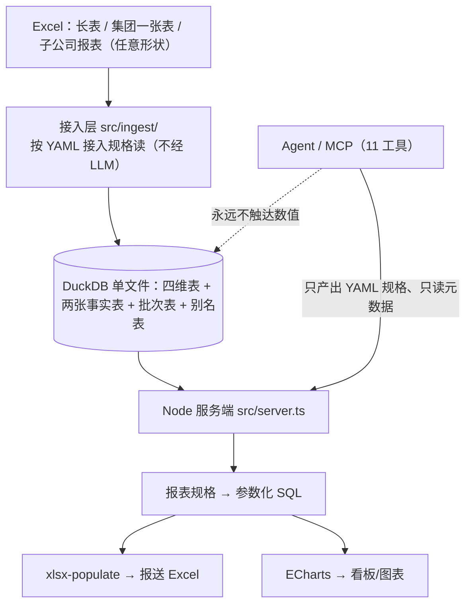

# bi-lite 需求与架构

> 状态：已敲定（v1）
> 定位：开源、轻量的本地 BI 引擎 —— CLI / MCP / Web 三个入口，共用同一套引擎

---

## 0. 一句话定位

**bi-lite 是一台开源、轻量的本地 BI 引擎：一份 Excel 加一份 YAML 规格，就地建库、按模板出表。**

数据不交给任何服务：引擎跑在自己的机器上，唯一的数据可信源是本地那个 DuckDB 文件。

**两个方向**，都由 YAML 驱动：

| 方向 | 输入 | 规格（YAML） | 产出 |
|---|---|---|---|
| **进库** | 任意形状的 Excel（长表、集团一张表、子公司报表…） | **接入规格** | 本地星型库（维度 + 事实，DuckDB） |
| **出表** | 库里的数 | **报表规格** | 按模板渲染的报送 Excel / ECharts 图表 |

**三个入口，同一套引擎**：

| 入口 | 给谁用 | 怎么用 |
|---|---|---|
| **CLI** | 人与脚本 | `bilite …`（**接入侧已落地**：`bin` → `src/cli.ts`，`bilite ingest lint\|dry-run\|run`；生成器侧 `plan/apply` 与物料侧 `catalog/validate/skill export` 随后，见 §11） |
| **MCP + skill** | agent | agent 与用户对话，把规格探明、敲定，再落库出表（§7） |
| **Web** | 人 | 浏览器三个页签：数据导入 → 看板查询 → 报表报送 |

**核心抽象只有一个**：`spec` —— 声明式规格（YAML）。接入规格说"这份 Excel 怎么读"，
报表规格说"这张表按什么口径算、填进哪张模板"。

**它不是 BI 看板**：数据只在进库环节进入一次，此后所有工作都是把已入库的数据按不同口径重新排布；
出表是主战场，看板是同一份 spec 的另一个 renderer。

---

## 1. 背景与痛点

### 1.1 现状

用户所在集团每月从财务平台导出 Excel 长表（按 财务期月份 × 公司名称 × 指标名称 组织），随后需要：

- **保送工作**：把财务数据按**不同接收方给定的表格形式**（行是哪些指标、列是哪些口径各不相同）重新排布成 Excel 报送
- **经营分析**：查询某公司/某指标的数据，按不同口径生成图表用于汇报

### 1.2 三个具体痛点

| # | 痛点 | 病根 |
|---|---|---|
| P1 | 填表靠人工从导出 Excel 抄到目标表格，容易出错 | 数据与排版焊死在同一个文件里 |
| P2 | 目标表格口径经常更换，Excel 超链接方式无法解决 | 排版规则没有被抽象成可参数化的东西 |
| P3 | 财务数据敏感，不能进入 LLM 上下文 | 缺少 agent 与 DB 之间的隔离层 |

P1 和 P2 是同一个病根的两个症状：**没有把"数据"与"排版"分离**。P3 决定了 agent 的接入方式必须是"只碰结构、不碰数值"。

---

## 2. 需求

### 2.1 功能需求

| ID | 需求 | 优先级 |
|---|---|---|
| F1 | 从**任意形状**的 Excel 导入财务数据（按**接入规格 YAML** 读取：长表 / 集团一张表 / 子公司报表），作为**唯一数据可信源** | P0 |
| F2 | 导入运营类数据（合同、业务线等），与财务数据共享公司/期间维度 | P1 |
| F3 | 用声明式规格（spec）描述一张报送表的行/列/口径/取值，并能参数化换月份、换口径 | P0 |
| F4 | 按 spec 渲染出 Excel，**保留原模板版式、样式、公式** | P0 |
| F5 | 按同一份 spec 渲染出图表（ECharts），用于看板与汇报 | P1 |
| F6 | Web 端可按公司/指标/月份便捷查询 | P1 |
| F7 | agent 作为规格录入入口：从 Excel 模板或自然语言产出 spec 草稿 | P2 |
| F8 | spec 定稿后入库，成为可复用的命名报表 | P1 |
| F9 | 导入时本地校验（唯一性、勾稽、空值、未识别主数据） | P1 |

### 2.2 非功能需求

| ID | 需求 | 说明 |
|---|---|---|
| N1 | 轻量 | Node + DuckDB + SQLite，**一个进程、两个文件、零外部服务** |
| N2 | 安全 | 财务明细不以明文进入 LLM 上下文 |
| N3 | 本地优先 | 数据不出本机；导入完全在 Web 手工触发 |
| N4 | 可追溯 | 数据可追到导入批次；重述历史可查 |
| N5 | 单机可用 | 不做多用户并发、不做集群 |

### 2.3 明确不做（Non-goals）

- ❌ 复杂图表编辑器 —— 精细排版交给 Office / Univer 生态
- ❌ 定时调度、告警、订阅推送
- ❌ 多租户、SSO、细粒度用户管理
- ❌ 对接外部数仓 / 实时数据流
- ❌ Agent 自主执行 SQL

---

## 3. 技术选型

| 层 | 选型 | 理由 |
|---|---|---|
| 运行时 | Node.js（≥ 22，本机 v26.7.0） | 单进程，无额外服务 |
| 明细存储 | **DuckDB + Parquet** | 列存，交叉聚合毫秒级；单文件；能直查 Parquet |
| 元数据存储 | **SQLite**（`node:sqlite` 内置） | spec、指标注册表、公司主数据、审计日志；量小但需事务 |
| DuckDB 绑定 | `@duckdb/node-api` | 官方新绑定，**不要用旧的 `duckdb` 包** |
| Excel 读写 | **xlsx-populate**（模板填充主选）<br>`exceljs`（仅无图表/图片/批注时可用，见 §5.3） | 见 §5.3.1：exceljs 对真实模板**读入即崩**，写出还会静默删 8 类部件 |
| 前端 | 待定（优先轻量：原生 + ECharts 或轻框架） | 需求简单，不引入重框架 |
| 图表 | ECharts | 足够简单够用 |
| 后端 | Node HTTP（原生或轻量框架） | 与 N1 一致 |

**不选**：FastAPI/Python（双进程）、Metabase/Superset（太重）、纯内存（无法作可信源）。

### 3.0 依赖版本（本机已核实，2026-09）

| 包 | 版本 | 核实方式 |
|---|---|---|
| Node.js | v26.7.0 | `node -v` |
| `node:sqlite` | 内置可用（导出 `DatabaseSync`/`StatementSync`） | `node -e` 实测，**无需第三方包** |
| `@duckdb/node-api` | 1.5.5-r.5 | `npm view` |
| `jszip` | 4.x | 实测已用于原型（兜底路径） |
| `xlsx-populate` | 1.21.0 | **模板填充主选**，实测 extLst 逐字节保留 |
| `exceljs` | 4.4.0 | `npm view`，**仅只读且模板无图表/图片/批注时可用** |
| `echarts` | 6.1.0 | `npm view` |
| `yaml` | 2.6.x | spec 解析；**第 5 步的推断器仍手写 YAML 输出**——因为注释是草稿的主要价值（`renderYaml()` 会标注哪一行是"换口径时该改的那行"），`yaml.stringify()` 做不到 |
| MCP 协议 | **手写零依赖** | 官方 `@modelcontextprotocol/server@2.1.0` 实测只拉 2 个包但共 **16MB**（zod 占 8MB）；实际协议面只有 4 个方法，见 §3.2 |

> 本机 npm 全局缓存有 root 属主文件会导致 EPERM，安装时用 `--cache /tmp/npm-cache-$$` 绕过。

### 3.2 ⚠️ MCP 协议：实测的握手序列与决策（手写而非引 SDK）

agent 入口（§7）需要实现 MCP 服务端。**决策：手写 stdio 层，零依赖。** 依据是本机实测：

**① 官方 SDK 的成本（实测）**：`npm i @modelcontextprotocol/server@2.1.0` 只拉 2 个直接依赖，
但磁盘占用 **16MB**（`@modelcontextprotocol/server` 6.3M + **`zod` 8.0M** + `core` 1.3M）；
`@modelcontextprotocol/sdk@1.30.1` 更重（17 个依赖含 express/hono/jose/ajv）。
而本项目已有「手写零框架 HTTP 层」的先例（`src/server.ts`），零依赖是既定纪律。

**② 实际协议面极小**。用 DSH 自带的真实 MCP 客户端连一个探针服务端，实测握手序列**逐字**为：

```
1. {"method":"initialize","params":{"protocolVersion":"2025-11-25","capabilities":{},
     "clientInfo":{"name":"...","version":"..."}},"jsonrpc":"2.0","id":0}
2. {"jsonrpc":"2.0","method":"notifications/initialized"}        ← 通知书，无 id
3. {"method":"tools/list","jsonrpc":"2.0","id":1}
4. {"method":"tools/call","params":{"name":"...","arguments":{...}},"jsonrpc":"2.0","id":2}
```

**③ 两个必须记住的协议细节**（DSH 客户端用 `versionNegotiation: { mode: 'auto' }`）：

| 细节 | 要求 | 不这么做的后果 |
|---|---|---|
| `server/discover` | **必须回一个 JSON-RPC 错误**（本实现回 `-32601 Method not found`） | 沉默不答会让探测窗口**超时**，而不是回落 legacy |
| `initialize` 的版本 | 回**客户端请求的版本**（若在已知列表内），否则回自己的最新版 | 版本不匹配可能被客户端拒绝 |

> SDK 的 `classifyRpcError` 对**任何** JSON-RPC 错误都回落 legacy（除 `-32022 UNSUPPORTED_PROTOCOL_VERSION` 有特殊分支），
> 所以不需要实现 `server/discover` 的任何实际功能。

**④ 分帧**：换行分隔的 JSON-RPC 2.0（`JSON.stringify(msg) + "\n"`，读取时剥掉 `\r`）。
**stdout 是协议通道——任何 `console.log` 都会破坏协议，日志一律走 stderr。**

**⑤ 漂移风险的对冲方式**：不靠"照文档实现"，而是让 **e2e 第 13 阶段用 DSH 自带的真实客户端 SDK 连本服务**
（`@modelcontextprotocol/client` 的 `Client` + `StdioClientTransport`，含 `versionNegotiation: auto`）。
协议若漂移，验收会红，而不是等到用户接上才发现。

### 3.1 关键约束

#### 3.1.1 ⚠️ DuckDB 单写者锁：实测矩阵（这条推翻了"只读并发没问题"的常识）

| 场景 | 结果 |
|---|---|
| 同进程同 instance 多连接：读 / 写 | ✅ / ✅ |
| 同进程另建 instance（rw）/ READ_ONLY | ✅ / ✅ |
| **跨进程第二个 writer** | ❌ |
| **跨进程第二个 READ_ONLY** | ❌ **同样拒绝** |
| 无写者时 3 个并发 READ_ONLY | ✅ |

实测报错：
```
IO Error: Could not set lock on file "...": Conflicting lock is held in .../node (PID 18935) by user zhaofuqing.
```

**关键结论**：官方那句 "multiple processes can read" **只在没有任何写者时成立**。一旦有进程以 read-write 打开数据库，其它进程无论 rw 还是 `READ_ONLY` **全部拿不到锁**。

**「导入不阻塞查询」的答案**（官方无专门章节，综合结论）：

| 方案 | 做法 | 评价 |
|---|---|---|
| **同进程多连接**（推荐） | 导入与查询放同一进程、不同连接。MVCC 让读不被写阻塞，官方原文 "Appends will never conflict, even on the same table" | 最简单；注意同 instance 并发查询**共享 `memory_limit` 预算**，需自己限并发 |
| **每批只写 Parquet**（推荐，见 §4.4） | 写者只 `COPY batch TO '/data/batches/xxx.parquet'`，主库 `FROM '/data/batches/*.parquet'` | **实测跨进程零锁冲突**，彻底绕开问题 |
| 共享 DuckDB 库文件 + 写者写完释放 | 主进程 `ATTACH ... (READ_ONLY)` | ⚠️ 写者存活期间 ATTACH 必失败 |

> 未来方向：官方新增 **Quack 远程协议**（v1.5.2 beta，预计 v2.0 / 2026 秋季成熟）用于多进程写；稳定方案推荐 **DuckLake + PostgreSQL catalog**。

#### 3.1.2 其他约束

- **口径是列，不是行。** `period_type` 作为 `fact_finance` 的字段，而不是把它当独立指标名塞进 `metric_id`。
- **账面累计必须实存。** 含调整，不能从单月派生。
- **必须锁死 `@duckdb/node-api` 版本。** CVE-2025-59037（[GHSA-w62p-hx95-gf2c](https://github.com/duckdb/duckdb-node/security/advisories/GHSA-w62p-hx95-gf2c)，high）：1.3.3 系列被植入干扰加密货币交易的恶意代码（维护者被 npmjs 钓鱼站骗走账号）。**用 `^` 浮动版本有风险。**
- **`@duckdb/node-api` 目前不支持 UDF/UDT**，且不支持 windows_arm64。若需自定义函数要提前评估。


---

## 4. 数据模型

采用 Kimball 星型模型：维度共享，事实表按业务域拆分。

### 4.1 维度表

```sql
-- 公司维度：必须有层级，支撑"按板块汇总"这类保送需求
CREATE TABLE dim_company (
  id         VARCHAR PRIMARY KEY,
  name       VARCHAR NOT NULL,
  parent_id  VARCHAR,          -- 自引用，集团→子公司多层树
  level      INTEGER,          -- 层级深度
  group_name VARCHAR,          -- 所属板块
  alias      VARCHAR[]         -- 导入时识别到的别名
);

-- 指标维度
CREATE TABLE dim_metric (
  id        VARCHAR PRIMARY KEY,
  name      VARCHAR NOT NULL,
  category  VARCHAR,           -- 主要指标 / 盈利指标 ...  用于 spec 的 filter
  unit      VARCHAR,           -- 元 / 万元 / %
  direction VARCHAR,           -- positive（越大越好）/ negative（成本类）
  alias     VARCHAR[]
);

-- 期间维度：财务期与自然月可能不一致
CREATE TABLE dim_period (
  fin_month  DATE PRIMARY KEY,  -- 财务期月份
  year       INTEGER,
  month      INTEGER,
  is_audited BOOLEAN
);
```

### 4.2 事实表

```sql
-- 财务事实：三维交点 × 口径
CREATE TABLE fact_finance (
  fin_month   DATE    NOT NULL,
  company_id  VARCHAR NOT NULL,
  metric_id   VARCHAR NOT NULL,
  period_type VARCHAR NOT NULL,   -- 本年累计/去年同期累计/单月/单月同比/账面累计
  amount      DECIMAL(18,2),
  batch_id    VARCHAR,            -- 溯源：哪次导入
  PRIMARY KEY (fin_month, company_id, metric_id, period_type)
);

-- 运营事实独立成表，共享 dim_company / dim_period
-- 不要塞进 fact_finance：量纲、频率、口径体系都不同
CREATE TABLE fact_contract (...);
CREATE TABLE fact_business_line (...);
```

### 4.3 导入批次（可追溯）

```sql
CREATE TABLE import_batch (
  batch_id    VARCHAR PRIMARY KEY,
  source_file VARCHAR,
  row_count   INTEGER,
  imported_at TIMESTAMP,
  status      VARCHAR,        -- pending / validated / committed / rolled_back
  note        VARCHAR
);
```

查询默认取最新批次，但保留历史。财务数据会重述，报送被质疑时要能说清用的是哪一版。

### 4.4 落盘策略：单进程独占 DuckDB（已简化）

> **本节已根据实际使用模式简化。** 原始方案是「每批一个 Parquet + glob 读」以绕开跨进程锁；确认**写入只在导入时发生、每月几次**后，这个复杂度不必要。

**采用**：一个 `.duckdb` 文件，**由 Node 服务端单进程独占**，导入和查询用同进程内的不同连接。

**依据（本机实测）**：

| 场景 | 结果 |
|---|---|
| 写事务未提交时，另一连接读 | ✅ 不阻塞（实测 1ms 返回） |
| 提交后立刻可见 | ✅ |
| 读写交错 5 轮 | ✅ 全部成功 |

DuckDB 的 MVCC 让**同进程内的读不被写阻塞**，这正是导入时用户仍能查询的原因。

**仍然保留 Parquet 作为归档层**（不是并发手段，而是备份与溯源手段）：

```
data/parquet/fact_finance/batch=<batch_id>/part.parquet
```

导入时同时写一份 Parquet 归档，用途：① 数据库损坏时可重建；② 财务数据重述时能回溯到某一批的原始形态；③ `filename` 虚拟列做来源追溯。

#### 4.4.1 归档必须绕开主实例的硬化（实测踩坑）

主实例开着 `enable_external_access: 'false'`（安全硬化，见 §6.2），而 **`COPY ... TO` 属于外部文件操作，会被这条配置直接拒绝**：

```
Permission Error: Cannot access file "data/parquet/fact_finance/batch=<id>/part.parquet"
- file system operations are disabled by configuration
```

这不是配置错误，而是两条目标（**硬化** 与 **归档**）在同一个实例上**根本互斥**。曾试图用 `allowed_directories` 收窄来解决，实测三条都走不通：

| 尝试 | 实测结果 |
|---|---|
| `enable_external_access=false` + `allowed_directories=[...]` | ❌ `Cannot change allowed_directories when enable_external_access is disabled` |
| 先开 `external_access=true`，再 `SET allowed_directories` | ❌ 若开了 `lock_configuration` 则 `configuration has been locked`；不开则 SET 成功但**仍能读 `/etc/passwd`** |
| 只用 `allowed_directories` 指望它拦读 | ❌ 实测不拦截 `read_text` / `read_csv`，**不能当安全边界** |

**采用解法**：归档时另开一个**短命只读实例**（`access_mode: 'READ_ONLY'` + `enable_external_access: 'true'`）来执行 `COPY`，用完即 `closeSync()`。见 `src/db/index.ts` 的 `exportParquet()`。

三条关键性质（均已实测）：

1. **只读实例写不了主库** —— 对主库执行 `INSERT` 报 `Invalid Input Error: Cannot execute statement of type "INSERT" on database ... in read-only mode`；即使这段代码被误用也伤不到数据。
2. **主实例硬化完全不受影响** —— 归档前后，主连接执行 `read_text('/etc/passwd')` 始终被拒。两实例并存时，主实例照常查询。
3. **反复开合稳定** —— 连续 5 轮归档全部成功，主实例始终可查询。

> ★★ **但有一条更晚才实测出来的性质，必须写在这里（否则上面这套推理会把人带沟里）**：
> **关掉那个只读实例会把主实例的库锁一起丢掉。** 实测：归档之前第二个进程 `db.open()` 报
> `Could not set lock on file`；**归档一次之后，它就能直接开进来了**（`CHECKPOINT`、空查询都拿不回锁，
> 只有"把主实例关掉重开"能拿回来）。于是**两个写者同时操作一个库** —— 而后果是
> 主实例后续的归档全部读到**过期视图**，写出**只有表头、0 行的 Parquet**，
> 而 `archived` 还报 `true`（实测：960 行的批次写成 **222 字节**；e2e 里从第 15 阶段起的归档全中招）。
> 另一面：只读实例是"**创建那一刻的快照**"，把它留着不关能保住锁、但再也看不见后来的提交。
>
> **现在的解法**（`exportParquet()`）：每次归档**新建**只读实例 → 写完在**同一个实例**上
> `read_parquet` 数一遍（对不上就抛错、`archived` 置 false）→ `finally` 里 **`reattach()`**
> 把主实例关掉重开、把锁拿回来。代价要认：重开那一瞬间旧连接失效，
> 但换来的是**库锁始终在主实例手上**。详见 `AGENTS.md` §4 备忘 13。
>
> **教训（比这条本身重要）**：`exportParquet()` 是**会改变跨进程状态边界**的操作 ——
> "同进程内、只读、用完即弃"这套说辞不成立，别再照着它推理。

> ⚠️ **另一条实测事实**：归档完成后，**主连接读不回 Parquet**（`read_parquet(...)` 同样被硬化拒绝）。这是预期行为 —— 主库进程本就不该碰任意文件。需要读归档时（如灾难恢复），另开一个独立实例，不要放松主连接的配置。

> ⚠️ **教训（已记入 R13）**：这个 bug 之所以长期存在，是因为服务端当初用**裸 `catch {}`** 吞掉了归档异常，于是"归档静默不工作"而主链路毫无症状。现在接口回传 `archived: boolean`、失败必打日志，e2e 有 3 项断言守着。**凡是有意容错的地方，都必须留下可观测的痕迹。**

> ⚠️ **小文件陷阱**：实测 1000 行 parquet ≈ 4939 bytes（本次 960 行 ≈ 7729 bytes）。归档层累积大量 KB 级文件时需 compaction，但它不在查询关键路径上，可以低优先级处理。

**唯一需要遵守的纪律**：**同一时刻只有一个进程持有 `.duckdb`。** 三个入口（Web / MCP / CLI）都是「薄壳 + 自己开库」，互斥由 **DuckDB 的单写者锁**天然强制（实测：有跨进程写者时，其它进程连 `READ_ONLY` 都拿不到锁 —— 见 `AGENTS.md` §4 备忘 5）。被占用时**不静默失败**，明确报错并提示改用已在运行的入口。

> 本条原写作「服务端是唯一入口；CLI 若需要读，应通过服务端而非自己开库」。改为上面这句的理由有两条：
> ① **它与实现不符** —— `src/mcp/server.ts` 一直是独立进程、自己开库，规范文本与代码已经不一致；
> ② **它把已由锁免费提供的保障又叠了一层** —— 再要求"必须走服务端"，只会多出一条 API 面，还要把 MCP 一起改掉。
> 收敛成精确的不变式后，规范与实现、规范与 `AGENTS.md` §4 备忘 5 三者一致。


### 4.5 SQLite 侧并发配置

```js
db.pragma('journal_mode = WAL');
db.pragma('busy_timeout = 5000');
```

DuckDB 侧连接池限 1：`db.SetMaxOpenConns(1)` 的 Node 等价做法（注释原文："DuckDB is single-writer; more connections buy contention, not throughput."）。

**这个分工有官方背书**：DuckLake 官方 catalog 选择文档明确「single client → DuckDB catalog；**multiple local clients → SQLite catalog**；multi-user lakehouse → PostgreSQL」，并用 `ATTACH 'ducklake:sqlite:metadata.sqlite'` 语法；官方评价 SQLite「**effectively hiding the single-writer model**」。

### 4.6 导入流程（三态 + 类型推断）

导入对应 F1 / F9，是整条链路的第一环。设计借鉴 Lightdash 的 External source 与 Metabase 的类型推断。

#### 4.6.1 三态状态机（取自 Lightdash External source）

```
STAGED ──(用户确认列映射 + 命名)──→ SYNCING ──→ READY
   │                                              │
   └──(废弃，定期清理)                              └──(失败)──→ ERROR
```

| 态 | 含义 | 关键行为 |
|---|---|---|
| **STAGED** | 文件已上传、已嗅探，**尚未 commit** | 展示推断出的列类型与样例，等用户确认 |
| **SYNCING** | 正在写入 Parquet | 写临时目录，**不污染已有数据** |
| **READY** | 写入完成、原子 rename、可查 | 递增该表 version |
| **ERROR** | 失败 | 保留 staging 供排查，标记待清理 |

> 这个三态设计直接满足 F9：**校验发生在 STAGED 阶段，不通过就不 commit**。也满足 N4（可追溯）。

#### 4.6.2 列类型推断：DAG + 最近公共祖先（取自 Metabase，本方案最值得抄的单点）

财务长表的列角色其实已知（期间/公司/指标/口径/金额），**所以不需要完整 DAG 推断**；但两个配套策略应直接采用：

| 策略 | 取值 | 理由 |
|---|---|---|
| **采样行数** | `max-inferred-lines = 10` | Metabase 源码注释：健壮性/性能权衡。财务表结构稳定，10 行足够 |
| **空值约定** | 空串 → `NULL` | 避免 `''` 污染数值列，导致 `SUM` 静默出错 |
| **行宽校验** | 数据列数 > 表头列数 → **422 报错** | 宁可拒绝，不要静默截断 |

**DAG 思想真正的用武之地在口径派生**：单月 → 累计 → 同比 本身就是一个有向无环图。可用同样的「最近公共祖先」思路判断**两个口径能否互相推导**——这能直接服务于 §5.2.1 的派生指标校验（防止 spec 里写了不可推导的派生式）。

#### 4.6.3 导入校验清单（F9）

| 校验 | 说明 | 失败处理 |
|---|---|---|
| **唯一性** | 三维交点 + 口径是否重复 | 报重复坐标，阻止提交 |
| **勾稽** | 累计 ≈ 各单月之和（账面累计除外，含调整） | 超出容差告警，人工确认 |
| **空值** | 关键维度不得为空；金额允许为空但需标记 | 列表展示 |
| **主数据识别** | 公司名/指标名是否都在维度表或 alias 中 | **输出"未识别名称"清单让人确认**（见 §10 R1，最关键） |
| **类型** | 金额列能否解析为数值 | 报出问题行号 |

#### 4.6.4 公式注入防护（取自 Superset）

导出报表时，以 `= + - @` 开头的字符串必须加 `'` 前缀：

```js
const FORMULA_PREFIXES = ['=', '+', '-', '@'];
const quoteFormulas = (v) => typeof v === 'string' && FORMULA_PREFIXES.includes(v[0]) ? `'${v}` : v;
```

**为什么必要**：公司名/指标名来自外部 Excel，理论上可被构造为公式。防的是导出文件在别人机器上执行。


---

## 5. 核心抽象：口径规格（spec）

### 5.1 设计原则

**spec 是"透视表的声明式版本"。** 它是数据与排版之间的唯一中间层，也是 bi-lite 的领域语言——人和 agent 都写它。

一份 spec = 若干 block。每个 block 描述：

- `anchor`：写到目标表格的哪个位置（**优先用定义名称**，见 §5.3.3）
- `rows`：行方向绑定哪个维度 + 过滤条件
- `cols`：列方向绑定哪个维度 + 排序（**换口径只改这一行**）
- `value`：取值用哪个度量 + 聚合方式 + 显示格式
- `scope`：可参数化的时间/公司等

### 5.2 示例

```yaml
id: 集团月度保送表
template: templates/月度保送表.xlsx    # 原模板作为版式来源
params:
  year: 2026
  month: 6

sheets:
  - name: 主要指标
    blocks:
      - anchor: B4                      # 模板中数据的左上角（或用定义名称 DATA_AREA）
        rows:
          dim: metric
          filter: { category: 主要指标 }
          order: [营业收入, 利润总额, ...]
        cols:
          dim: period_type              # ← 换口径只改这里
          order: [本年累计, 去年同期累计, 单月, 单月同比]
        value:
          measure: amount
          agg: sum
          format: "#,##0.00"            # ← 同时管 Excel 单元格格式与看板显示
        scope:
          time:    { year: "{{year}}", month: "{{month}}" }
          company: { dim: company, filter: { group: "{{company}}" } }

  - name: 分板块汇总
    blocks:
      - anchor: B3
        rows: { dim: company, filter: { level: 1 } }
        cols: { dim: period_type, order: [本年累计] }
        value: { measure: amount, agg: sum, format: "#,##0.00" }
```

> **`format` 的设计取自 Lightdash**：它的 `format` 支持电子表格式格式串（如 `#,##0.00`）且**直接作用于导出**。bi-lite 照抄这一点 —— 让**同一个 format 同时管 Excel 单元格格式与看板显示**，避免两处维护。（见 §12.4.2）

### 5.2.1 派生指标

`value.measure` 除了取事实表字段，还应支持**派生表达式**（同比、占比、环比）：

```yaml
value:
  expr: "(本年累计 - 去年同期累计) / 去年同期累计"   # 引用同区其他口径列
  format: "0.0%"
```

这对应 Rill 的 measures 类型划分（simple / derived / time_comparison）。**派生逻辑放在语义层注册，不在 spec 里重复定义** —— 否则口径语义会漂移（见 §10 R6）。


### 5.3 渲染器

**一个 spec，两个 renderer：**

| renderer | 产物 | 关键技巧 |
|---|---|---|
| Excel | 报送表 | **打开原模板、只替换数据格的 XML 节点** —— 其余部分字节级原样保留 |
| Chart | ECharts 配置 | `rows` → x 轴/系列，`cols` → 分组或对比线 |

Excel 渲染是**决定成败的一环**：如果导出的表还要人工调格式，整个方案就白做了。

#### 5.3.1 ⚠️ 实测结论：exceljs 必须排除，改用 xlsx-populate（或定向 XML 替换）

> 两轮本机实测（2026-09，exceljs 4.4.0）**推翻了本节最初的方案**。exceljs 在**读**和**写**两条路上都会失败。

**失败一：对真实模板「读入即崩」。** 只要模板里有 1 个批注、或 1 个图表/图片，`xlsx.readFile()` 直接抛异常：

```
CRASH template.xlsx  :: Cannot read properties of undefined (reading 'anchors')   at lib/xlsx/xlsx.js:100:18
CRASH t_comment.xlsx :: Cannot read properties of undefined (reading 'comments')  at lib/xlsx/xform/sheet/worksheet-xform.js:453:55
OK    t_safe.xlsx    （仅合并/样式/数字格式/条件格式/数据验证时成功）
```

根因（源码级）：exceljs 用**硬编码正则识别自己写出的部件名**（`lib/xlsx/xlsx.js:386` = `/xl\/(comments\d+)[.]xml/`、`:381` = `/xl\/drawings\/([a-zA-Z0-9]+)[.]xml/`），而 openpyxl / Excel 实际写的是 `xl/comments/comment1.xml` → 匹配不到 → `options.comments[Target]` 为 undefined → 崩。**exceljs 自产文件自读 OK，跨工具模板必崩。** 对应其 open issue [#2949](https://github.com/exceljs/exceljs/issues/2949)（4.4.0，堆栈与实测一致）。

**失败二：即使读入成功，写出也会静默删除部件。** 另一轮实验：向模板注入 exceljs 不建模的"外来部件"（图表、图片、VBA 宏、透视表、切片器、richData、customXml），走 `readFile → 改数据格 → writeFile`。exceljs **从自己的内部模型重新生成了整个压缩包**，9 个部件中 **8 个被静默删除**：

```
❌ 丢失  xl/charts/chart1.xml          （图表）
❌ 丢失  xl/drawings/drawing1.xml      （图形）
❌ 丢失  xl/media/image1.png           （图片）
❌ 丢失  xl/vbaProject.bin             （VBA 宏）
❌ 丢失  xl/pivotTables/pivotTable1.xml（透视表）
❌ 丢失  xl/slicers/slicer1.xml        （切片器）
❌ 丢失  xl/richData/rdrichvalue.xml
❌ 丢失  customXml/item1.xml
❌ 丢失  docProps/custom.xml
```

模板自己这一侧（单元格样式、`numFmt`、合并、条件格式、数据验证、公式）在"自产自销"情况下能保住，但**只要模板是人在 Excel/WPS 里做的、带图表或宏的报送表，走这条路就会丢东西**。而且 ExcelJS **不报错**——静默损坏，最坏的一种失败。

此外还有两个次级破坏：**数据验证被拆成重叠重复规则**（实测 2 条 → 4 条，`C2:C1013` 变成 `C10:C1013` + `C2:C1013`）；现代 Excel 扩展（x14 数据条 / 图标集 / 迷你图）半丢。

仓库 open issues 809 个，最后 push **2025-01-21**。

#### 5.3.2 方案对比（全部本机实测）

| 方案 | 保真度 | 结论 |
|---|---|---|
| **xlsx-populate 1.21.0** | 17→18 部件，图表/图片/批注全在，`<extLst>` 与源文件**逐字节相同**（`byte-identical: True 1185 1185`） | ✅ **主选** |
| 自打 xlsx XML 补丁 | 最高（不碰其它部件），同上实验 9/9 全保 | ✅ 兜底 |
| xlsx-template 1.4.7 | 保真同级（18→18 部件），但**占位符 `${}` 必须事先写进模板** | ⚠️ 仅自控模板 |
| openpyxl 3.1.5 (Python) | 部件 17→17，但**静默删掉所有 x14 扩展**（数据条/图标集/迷你图），且基础 `<cfRule>` 带 `id` 属性时**整条丢弃** | ❌ 不值得引子进程 |
| **exceljs 4.4.0** | 读入崩溃 / 图表图片丢失 / 数据验证被破坏 | ❌ **排除** |

**关于 openpyxl**（回应"值不值得为这一步引 Python"）：它比 exceljs 可靠得多，但有一个致命行为——对现代 Excel 扩展会打印 `UserWarning: ... extension is not supported and will be removed` 并**全部删除**（源码 `openpyxl/worksheet/_reader.py:325-330`）。官方文档自认："shapes will be lost from existing files if they are opened and saved with the same name"。**引 Python 子进程会得到一个更差的结果 + 额外部署复杂度，不划算。**

**保真度排序：自打 XML 补丁 = xlsx-populate > openpyxl > exceljs。**

#### 5.3.3 主选方案的用法

`xlsx-populate` 的 README 原话是 "just manipulates the XML data"，这正是它保真的原因：

```js
const XLSXPopulate = require('xlsx-populate');
const workbook = await XLSXPopulate.fromFileAsync('template.xlsx');

// 用定义名称定位锚点（不依赖硬编码坐标）。
// ⚠️ 实测注意：definedName() 返回的是**已解析好的 Cell 对象**，不是地址字符串，
//    可直接取 rowNumber()/columnNumber()；名称不存在时返回 undefined（不抛错）。
//    而 Sheet.cell() 只接受 "B4" 或 (row, col)，传定义名称会崩在 addressConverter。
const start = workbook.definedName('DATA_START');
if (!start) throw new Error('模板中找不到定义名称: DATA_START');
const { row, col } = { row: start.rowNumber(), col: start.columnNumber() };

workbook.sheet(start.sheet().name()).cell(row, col).value(1234.56);
await workbook.toFileAsync('out.xlsx');
```

> **推荐用「定义名称」而非硬编码坐标定位锚点** —— 模板改版式时，命名区域跟着走，spec 不用改。

**兜底路径（自打 XML 补丁）**：xlsx 本质是 zip + XML。只解压、只改目标 sheet 的 XML、其余 entry 原样拷贝。

```js
// 只替换目标单元格的 <c> 节点，保留 s=（样式索引）
function setNumericCell(sheetXml, ref, value) {
  const re = new RegExp(`<c r="${ref}"([^>]*?)(?:/>|>([\\s\\S]*?)</c>)`);
  const m = sheetXml.match(re);
  if (!m) return { xml: sheetXml, ok: false };
  const attrs = m[1].replace(/\s+t="[^"]*"/g, '');   // 去掉旧类型
  return { xml: sheetXml.replace(re, `<c r="${ref}"${attrs}><v>${value}</v></c>`), ok: true };
}

// 文本走 inline string，避免动 sharedStrings.xml
// `<c r="A4" s="2" t="inlineStr"><is><t>营业收入</t></is></c>`
```

实测：9/9 外来部件全保，样式索引 / numFmt / 条件格式 / 数据验证 / 公式全在，产物可被 Excel 与 ExcelJS 正常解析。

**维护状态提示**：`xlsx-populate` 1.21.0 发布于 2020-03，仓库最后 push 2024-03-12 —— **功能冻结但可用**；社区 fork `@eyeseetea/xlsx-populate` 4.3.1 可作备选。正因如此，**自打 XML 补丁作为兜底路径是必要的**，不宜完全押注单一第三方库。

#### 5.3.4 必须提前决定的坑

| # | 坑 | 应对 |
|---|---|---|
| 1 | **公式缓存值**：xlsx-populate **不会重算公式、也不会写回缓存值**（README 原文 "will not recalculate the values ... and will not write the values to the output"；实测 `<v/>` 被移除） | 若下游要**直接读公式列的数值**（不经 Excel 打开），需自打补丁保留 `<v>`，或改由服务端计算 |
| 2 | **共享公式 / 数组公式**：往从属格写值会破坏公式链 | 解析阶段检查 `<f>` 与 `t="shared"`，识别并绕开 |
| 3 | **合并单元格**：只能往合并区左上角写 | 解析阶段把合并区归一化到锚点，否则 Excel 报文件损坏 |
| 4 | **重打包必须带 `[Content_Types].xml`**（自打补丁路径） | 否则文件直接损坏 |
| 5 | 公式缓存过期 | Excel 打开时自动重算，属正常；需精确可设 `fullCalcOnLoad` |
| 6 | **`cell.style(...)` 的读路径会污染样式表**：`cell.style('numberFormat')` 内部走 `styleSheet().createStyle()`，会向 `styles.xml` **追加**整套 font/fill/border/xf。实测仅"读"20 格格式就把 `styles.xml` 从 **2839B 涨到 7947B**、fonts **4→24**、cellXfs **8→28** | **要用 `getNumberFormatCode()` 这条纯只读路径**：从 `styleSheet()._cellXfsNode.children[cell._styleId].attributes.numFmtId` 取 id，再查格式码。改用后 `styles.xml` 反而降到 2788B（见 §5.3.5） |
| 7 | **spec 的 `format` 会覆盖模板设计**：模板数据格本就设了 `#,##0.00;[Red]-#,##0.00`（负数标红），若无条件套用 spec 的 `#,##0.00`，红色负数格式即丢失 | **模板优先**：该格已是显式格式（非 General）就保留，只在 General 格上套用 spec 的 format（见 §5.3.5） |

#### 5.3.5 填充保真实测（e2e 已固化为回归测试）

> 本节结论来自 `test/e2e.ts` 第 6 阶段（版式保真）的断言（构造了一个含图表/图片/批注/公式/条件格式/数据验证/冻结窗格/定义名称/合并单元格的模板，并用 JSZip 注入 `xl/charts/chart1.xml`、`xl/media/image1.png`、`customXml/item1.xml` 等外来部件）。

**保留情况（全部 ✅）**：zip 部件数 18→18、零丢失；`xl/charts/chart1.xml` 与 `xl/media/image1.png` **逐字节相同**；合并单元格 / 条件格式 / 数据验证 / 公式 / 定义名称 / 冻结窗格 / 批注部件全部原样；`styles.xml` 未膨胀。

**逐部件字节比对的诚实结论**：18 个部件中 8 个逐字节相同，10 个发生变化 —— `xl/worksheets/sheet1.xml`（本就该变，写入了数据）、`styles.xml`、`sharedStrings.xml`、`workbook.xml`、`docProps/app.xml`、`docProps/core.xml`、`xl/_rels/workbook.xml.rels`、`xl/worksheets/_rels/sheet1.xml.rels`、`[Content_Types].xml`。
经元素级比对，这 10 个的变化**全是良性序列化差异**：属性顺序、空白、`&apos;` 转义、`<dimension>` 与 `<sheetPr/>` 的写法差异、`workbook.xml` 补了 `<bookViews>`。**功能元素集合相同，无一丢失。**

> ⚠️ 但这对**下游有电子签章 / 哈希校验 / 按字节比对的归档系统**是风险。报送流程若涉及此类下游，需提前确认（已记入 §10 R11）。

**两条硬规则**（代码里已实现，勿改回）：

```js
// 规则一：读数字格式必须走纯只读路径，不能用 cell.style()
const styleId = cell._styleId;
const node = wb.styleSheet()._cellXfsNode.children[styleId];
const numFmtId = Number(node?.attributes?.numFmtId ?? 0);
const existing = numFmtId ? wb.styleSheet().getNumberFormatCode(numFmtId) : 'General';

// 规则二：模板优先 —— 只有 General 格才套用 spec 的 format
if (!existing || existing === 'General') cell.style('numberFormat', block.format);
```

**结论与分工**：

| 用途 | 用什么 |
|---|---|
| **填数据格（生产路径）** | **xlsx-populate**（兜底：JSZip + 定向 XML 替换） |
| 解析模板结构、定位区域、读表头 | exceljs 只读（**仅在模板无图表/图片/批注时**）或 xlsx-populate |
| 从零生成简单工作簿（无模板时） | exceljs / xlsx-populate |

这条实测把 §10 的 R4 从"最高技术风险"降级为"路径已明确"。


### 5.4 把 spec 编译成 SQL

spec 在**服务端**编译成参数化 SQL，在 DuckDB 内执行。agent 从不接触 SQL。

```
spec (YAML)  ──编译──→  parameterized SQL  ──执行──→  cell matrix  ──填充──→  Excel
                                   │
                                   └──→ ECharts spec
```

---

## 6. 安全设计

### 6.1 威胁模型

主要风险不是"数据库被攻破"，而是**财务明细通过聚合值被反推**：agent 若可自由查询，可逐个维度组合查询，拼凑出单月明细。

### 6.2 四层防护

| 层 | 措施 |
|---|---|
| ① 能力边界 | agent **没有 SQL 权**。只暴露 5 个 MCP 工具（见 §7.1），无 shell，无法把裸 SQL 送进 DB |
| ② 语义层做桥梁 | agent 拿的是**坐标而非数值**。`preview_spec` 返回"将填入哪些单元格、哪些行列标签"，不返回金额 |
| ③ 查询下推 | spec 在服务端编译执行；自由问答走 `query_metrics`，`group_by` 只接受已注册维度，强制行数上限与聚合阈值（明细行数过少直接拒答） |
| ④ 输出脱敏 + 审计 | 金额可返回分档值（如 `12.3亿`）或归一化序列；`render_report` 只回文件路径不回内容；每次调用记录字段级输出 |

#### 6.2.2 阈值是「受众」的属性，不是「查询」的属性（实测修正）

初版实现把聚合阈值与脱敏当成查询属性，一刀切；e2e 立刻暴露它同时**过松**与**过严**。修正后的规则：

| 受众 | 谁在用 | 金额 | 每格明细行数下限 | 行数上限 |
|---|---|---|---|---|
| `human` | Web 看板，已授权的财务人员 | **精确值** | 0（不设限） | 5000 |
| `agent` | LLM / MCP | **分档值**（`12.3亿`） | **3** | 200 |

理由：§6.1 的威胁模型针对的是 **agent 逐维拼凑反推**，而人本来就该看到单月单指标的数字。把阈值加在查询上会毁掉 Web 看板。

**判据必须是"每格背后的明细行数"，不是"单元格个数"** —— 这是 e2e 抓出的真 bug。初版按有效单元格个数计阈值，结果「公司 × 指标」单月网格有 20 格、顺利通过，却**每格只有 1 行明细支撑**，正是最该拒绝的探测式查询。现在的实现让 SQL 为每个度量列并出 `count(CASE WHEN <cond> THEN 1 END) AS n{i}`，执行时取所有非空格支撑数的最小值 `minSupport`，判 `minSupport < 3` 则拒答：

```
结果过于精细（每格仅 1 行明细支撑 < 阈值 3），拒绝返回。请放宽维度或改用累计口径以覆盖更多明细行。
```

阈值取 **3** 的依据：财务「累计」类口径通常覆盖多个月（1 格 ≥ 6 行），而「单月 × 单指标 × 单公司」恰好 = 1 行。阈值 3 恰好挡住后者且不误伤正常看板查询。实测 agent 查全年按公司分组时 `minSupport = 12` 顺利放行。

> **与主流开源 BI 的关键差异**：调研了 Lightdash / Metabase / Superset 三家，**它们的 MCP 都暴露原始 SQL** —— Lightdash `run_sql`（gated on `manage:SqlRunner`）、Metabase `execute_sql`（需 native-query 权限，可实例级关）、Superset `execute_sql`（需 `can_execute_sql_query`，用 SQL 解析拦截 DROP/TRUNCATE/ALTER）。
>
> 它们做的是「**给 LLM SQL 权 + 独立权限闸门**」；bi-lite 做的是「**根本不给 SQL 权**」。前者适合通用分析场景，后者适合财务数据不出本地进程的硬约束。**这是 bi-lite 安全设计上最重要的自主决策，不是抄来的。**

#### 6.2.1 值得抄的三条治理实践

| 来源 | 做法 | 为什么值得抄 |
|---|---|---|
| Superset | `MCP_RBAC_ENABLED` 默认 True，每个工具声明 `class_permission_name`/`method_permission_name`，逐工具校验 FAB 权限，全量进 action log | 「**权限跟着工具走**」比在入口做一次检查更不易漏 |
| Superset | `MCP_TOOL_SEARCH_CONFIG`：bm25 工具检索，`max_results=5`，把初始工具目录从约 **15–20K tokens 压到 4–5K** | bi-lite 只有 12 个工具，暂不需要；但未来工具变多时是标准解法 |
| Superset | `MCP_RESPONSE_SIZE_CONFIG`：`max_bytes=50000`、`max_list_items=100`，超限返回最小确认 + `_response_truncated` 标记 | **与 §6.2 的聚合阈值同源思路**：控制返回体积既是省 token，也是防泄漏 |
| Lightdash | `AgentSqlScope{schemas, catalogs, deniedSchemas, deniedCatalogs}`，并**明确标注"这是正确性控制而非安全边界"** | 诚实标注约束性质的工程态度；bi-lite 无 SQL 权，但同类标注习惯可学 |

### 6.3 核心原则

> **agent 产出规格，不产出数据。**
> 它负责理解口径、编排规格、生成报告；流经它的永远是"结构"和"指令"，不是"金额"。

**一个重要的推论**：改口径这个核心动作本来就只需要 spec 的 diff，不需要数值参与。因此"财务数据不进上下文"不是靠过滤实现的，而是**架构上自然达成**——数值第一次出现在人的浏览器预览里，而不是 LLM 上下文里。

### 6.4 其他

- 导入链路完全在 Web 手工触发、本地校验，**不经过 agent**，天然安全

#### 6.4.1 静态加密现状（实测）

**结论：文件系统级加密是基线，DuckDB 原生加密只能作额外防护。**

DuckDB **v1.4.0+ 有原生加密**，但有两个实测限制：

1. **Node 侧只能用 SQL 开启**。`DuckDBInstance.create(path, {encryption_key:'...'})` 报错：
   ```
   Invalid Input Error: The following options were not recognized: encryption_key
   ```
   `configurationOptionDescriptions()` 的 299 项里**没有** `encryption_key`。唯一路径是 SQL：
   ```sql
   ATTACH '/data/bi.duckdb' AS enc (ENCRYPTION_KEY '...32bytes...');  -- 可选 ENCRYPTION_CIPHER 'CTR'
   COPY FROM DATABASE plain TO enc;                                   -- 迁移
   SELECT database_name, encrypted, cipher FROM duckdb_databases();   -- 实测 → [['enc', true, 'GCM']]
   ```
   错误密钥报 `Wrong encryption key used to open the database file`；不给密钥报 `Cannot open encrypted database ... without a key`。

2. **不满足合规要求**。官方明说："**DuckDB's encryption does not yet meet the official NIST requirements**"（跟踪 [duckdb#20162](https://github.com/duckdb/duckdb/issues/20162)）。

- 因此：**DuckDB 文件必须放在不会被云同步的目录**，并叠加文件系统级加密（macOS FileVault / 加密磁盘映像）。原生加密作纵深防御的第二层。
- 附：给 key 后 WAL 默认加密；`temp_file_encryption` 也是合法配置项。
- 审计日志记录：谁（哪个客户端）、何时、调用了哪个工具、返回了什么字段级信息


---

## 7. Agent 集成

### 7.1 MCP 工具集（仅此十二个）

**看现状（1 个）** —— agent 写 YAML 的依据之一（§8.5）：

| 工具 | 作用 | 是否返回数值 |
|---|---|---|
| `get_catalog` | 导出**库里现在有什么**：L1 业务成员（已注册的指标/公司/口径/维度）、L2 物理结构（表/列/角色/粒度）、L3 版本。传 `object` 只看一张表（**按需下钻是默认用法**） | 否（只有结构与成员名，**连格里的值都不查**） |

**出表侧（7 个）** —— 从库里的数到报送表：

| 工具 | 作用 | 是否返回数值 |
|---|---|---|
| `list_metrics` | 列出已注册指标/维度/口径 | 否（仅元数据） |
| `get_template_schema` | 解析模板结构，返回锚点与表头布局 | 否（**模板里的数字也不回传**） |
| `lint_spec` | **静态诊断**：欠约束/表达式/join 等结构问题 | 否（只读 spec 文本，**不查库**） |
| `preview_spec` | 返回 spec 将填充的坐标网格 | **否，且本工具不查库** |
| `render_report` | 执行渲染，返回文件路径 | 否（仅路径与计数） |
| `diff_report` | 比较两版 spec 的差异 | 否 |
| `generate_spec` | 从模板推断 spec 草稿（§7.2 路径 1） | 否（**本工具不查库**，只读模板结构） |

**进库侧（4 个）** —— 源 Excel 到星型表。这是"模板模糊时由 agent 与用户对话把规格敲定"的那条路：

| 工具 | 作用 | 是否返回数值 |
|---|---|---|
| `look_at_source` | 看一份源的**文本视图**：表头文本、行标签文本、哪些格是数字（只报 `{num:true}`，**永不回传数值**）、哪些行带公式 | 否 |
| `lint_ingest` | 静态诊断接入规格：结构/列号/行键维度/值列与口径的对应/必需坐标（公司·指标·期数·口径）有没有来源 | 否（**连源文件都不读、不落库**） |
| `dry_run_ingest` | **干跑**：读出形状（数据行、被 drop 的行、重复行键、坐标完整性、期数、库里对不上的主数据名）+ 主数据判定（自动归并 / 要人拍板 / 会新建） | 否（一行都不落库） |
| `run_ingest` | 真正落库（两阶段 commit）；名字有歧义时**整批拒绝、一行不写**并回传要拍板的清单 | 否 |

**实现位置**：`src/mcp/tools.ts`（十一个工具 + 金额兜底 + 审计）、`src/mcp/server.ts`（零依赖 stdio 服务端，
协议细节见 §3.2）；给 agent 的操作手册是 `skills/bi-lite-ingest/SKILL.md`。

#### 7.1.0 `generate_spec`：推断器是提案者，不是决策者

`generate_spec` 把模板结构（§5.3）翻译成 spec 草稿，但它**不替人做判断**：

- 每个轴都带 `source` 字段，取值只有两个：`template`（**读到的** —— 模板 B4 左方一列真的预置了 5 个行标签）
  或 `guessed`（**猜的** —— 从角格「公司」对照注册表推出行维是 company，但模板里没有预置行清单）。
  返回值里的 `guessed` 数组把"猜的"那几项单独列出来，供人核对。
- 每个轴都带 `evidence` 字段，用一句自然语言说明**判断依据**（"锚点上方表头给出 4 个标签：…"）。
  人在 Web 上看到的就是这张"结论 + 依据"表 —— 依据比结论更需要人看。
- **轴判定要求全部命中才认定**：`matchDim()` 只有当一组标签**每一个**都落在某维度的取值集合里才认。
  避免"半数像指标"就武断下结论。
- **公式行先排除再判维**（实现 bug 的教训）：首版顺序反了，把「合计」这个公式行的标签送去匹配指标表，
  匹配当然失败，于是一个本该识别成功的数据区被判成"无法识别"。
  现在先按 `cell.formula()` 排除公式行，再对剩余标签做维度判定。
- 生成的 spec 固定带 `scope.time`（§11.3），让"漏时间范围导致静默加总"默认不发生。

`generate_spec` 与 `preview_spec` 一样**不查数据库** —— 只读模板结构与注册表，所以「不含金额」是结构保证。

#### 7.1.1 「预览不含金额」是结构保证，不是过滤

`preview_spec` **根本不调用数据库**。坐标完全由 spec 的 `rows.order`/`cols.order` 数量
加上模板锚点位置推出（`anchor + 行数/列数 → 区域引用`），因此"预览不含金额"不是一道
需要维护的过滤规则，而是**结构上不可能**。这是安全设计里最可靠的一类保证：
没有可绕过的判据，也就没有忘记判据的风险。

对照 `render_report`：它**必须**查库（否则填不了表），所以数值确实在进程内产生 ——
但它们在本地变量里停留、直接写进 Excel，**不进入返回值**（返回值只有
`outputPath`/`cellsWritten`/`blocks`/`formatKept`）。

#### 7.1.2 机械兜底：金额形状的数字一律拦截

`callTool()` 对每个工具返回值递归扫描，若出现 **≥ 10000 的数字**，本次调用直接失败：

```
内部错误：工具 XXX 的返回值出现疑似金额，已拦截（安全不变量）。
```

打印错。`AMOUNT_TRIPWIRE = 10_000` 的依据是所有工具返回的结构性数字都远小于它
（行数 ≤ 40、列数 ≤ 4、单元格数 ≤ 200、年份 2026），而财务金额普遍在万级以上。

**这道兜底不替代结构性设计**（§7.1.1），它防的是"将来某次改动不小心把数值带进返回值"。
效果是把一次**安静的泄漏**变成一次**响亮的报错**。它同时承认自身局限：
分档字符串（`12.3亿`）与真正的低额金额都过不了它，所以它只是第四道防线，不是第一道。

#### 7.1.3 审计日志记字段名，不记值

每次工具调用写一行 JSONL 到 `data/audit/mcp.jsonl`：

```json
{"at":"2026-09-26T08:55:04.023Z","tool":"preview_spec","ok":true,"ms":8,
 "argKeys":["specFile","params"],"resultKeys":["spec","from","params","blocks","plan","note"]}
```

只记**参数名与返回值字段名**，以及耗时；不记参数值、不记返回值。理由：审计的目的是回答
"谁在什么时候调了什么、返回了哪些字段"，而**记值就等于把金额写进另一个明文文件**——
那会把安全设计变成自我否定。审计写失败打 stderr 日志（铁律 12：禁止裸 `catch {}`），
但不中断工具调用（审计是旁路）。

### 7.2 三条输入路径，同一个产物

```
Excel 模板   ──┐                                    ┌──→ lint_spec（自检，不查库）
               ├──→ agent ──→ spec（草稿）───────────┤
自然语言描述 ──┘                                    └──→ 人在 Web 预览/微调 ──→ 定稿入库
                                                              │
                                                              └──→ 渲染 Excel / 图表
```

1. **现有模板** → agent 解析表头，猜出 rows/cols/value 映射，产出 spec 草稿
2. **自然语言** → "按板块对比今年和去年的利润总额" → agent 产出 spec 草稿
3. **人工直选** → 在 Web 上直接拖选（不用 agent 的路径）

#### 7.2.1 ★ 路径 2 的前置条件不是提示词，是让 spec 语言在解析期就挡住欠约束

一开始把路径 2 想成"提示词工程"（写个好 prompt 让 agent 别写错），实测之后发现这个思路
解决不了问题：**只要 spec 语言允许欠约束的写法，agent 每写一次就可能静默算错一次**，
而提示词挡不住、也测不了。所以路径 2 真正的工程量在 spec 语言本身。

实测确认的三个"静默算错"（都在 `src/spec/` 里修掉了，回归断言在第 14 阶段）：

| # | 症状（实测数字） | 根因 | 修法 |
|---|---|---|---|
| A | `rows: company / cols: period_type` 无指标约束 → 那一格返回 **67283**，真值 **65198**。五个指标的金额被**加成一个数** | 没有任何规则要求"量纲维"被钉住 | 新增 `src/spec/lint.ts`：`metric` 与 `period_type` 必须被钉住（做成轴或用 `scope.filter`），否则**解析即拒绝** |
| B | `value.expr` 写了却不算，返回 `[65198, 60870]`（两个原始累计额） | `compile.ts` 从不读 `block.value.expr` | 新增 `src/spec/expr.ts`（手写求值器，**不是 eval**）+ `runCompiled()` 重写：SQL 出 expr 的输入、JS 算输出 |
| C | `scope.company.filter` 引用 `dim_company` 却不建 JOIN → `Binder Error: 列不存在` | join 集合只遍历 `[rowsDim, colsDim]` | `needJoin` 补上 filter 引用的维度 |

**判据**：只有 `metric` 与 `period_type` 是**量纲维**（决定"这个数是什么"）；
公司/月份/年份只是"哪些数加进来"。前两者必须被钉住，后者可留空 ——
`rows: metric / cols: period_type` 且不限公司是**合法**的（集团合计，实测
16811+15940+17234+16841 = **66826**，正是 B4 的值）。

**为什么是"解析即拒绝"而不是"警告"**：财务场景下**静默算错比拒绝出表危险得多**。
错数字同量级、格式正常，人不会怀疑；表出不来，人一定会来查。

配套的四件事：

- `lint_spec`（第 7 个 MCP 工具）：agent 从自然语言写草稿后**自己先撞一次墙** ——
  ① 写草稿 → ② `lint_spec` 自检 → ③ 按 issues 修 → ④ `preview_spec` → ⑤ 人确认。
- `/api/specs/lint`：同一套判据的 HTTP 入口。
- Web 草稿框**边打字边诊断**：把"保存时被拒"提前成"打字时就看见哪里错"，保存按钮直接置灰。
- `diagnoseSpec()`：**一次给全所有问题**，而不是"改一条、再撞下一条"（`parseSpec` 遇错即抛，
  那是它该做的；诊断工具不能这样）。

**★ 判据只有一份**：结构诊断全部来自 `lintSpec`，`parseSpec`、`lint_spec`、
`/api/specs/lint`、Web 面板用的都是它。两份判据一定会漂移 ——
"工具说没问题、保存却被拒"是最难查的那类 bug，所以 e2e 里有一条断言专门比对
`lintSpec 判定「可保存」⇔ parseSpec 不抛`（对 5 个正反例逐一验证）。

**推断器也要受这条规则约束**：`generate_spec` 遇到模板里根本没有指标信息时
（如 fixture 的「分板块」sheet 只有「公司 × 本年累计」），**必须自报家门**：
返回 `draftValid: false` + 一条 error 级 issue 说明缺什么，草稿无法保存。
刻意**不**注入占位 filter —— 那样 spec 会重新变"合法"，保存成功、预览出数，
只是数字全空，人会把空当成"没数据"而不是"我忘了指定指标"。

### 7.3 交互风格

参考 Univer 的设计：**agent 是副驾驶**，能看懂当前上下文、提出修改建议，但**最终确认权在人手里**。agent 说"我把 B 列的 period_type 改了，请确认"，人在 Web 上确认时数值才第一次出现。

---

## 8. 架构总览



### 8.1 目录结构（拟定）

```
bi-lite/
├── docs/
│   ├── 需求与架构.md
│   └── tech-research-excel-template-and-duckdb.md
├── data/
│   ├── bi.duckdb              # DuckDB 库（单进程持有；或纯 Parquet 模式）
│   ├── meta.sqlite            # spec / 元数据 / 审计（WAL）
│   └── parquet/               # 每批一个文件：<table>/batch=<id>/part.parquet
├── specs/                     # spec 的 YAML 源文件（git 可版本化）
├── templates/                 # 报送表原模板
└── src/
    ├── server/                # Node HTTP 服务
    ├── db/                    # DuckDB / SQLite schema 与访问
    ├── import/                # Excel 解析、类型推断 DAG、校验
    ├── spec/                  # spec 解析 → SQL 编译
    ├── render/
    │   ├── excel.ts           # xlsx-populate 模板填充渲染器
    │   └── chart.ts           # ECharts 渲染器
    ├── mcp/                   # MCP 工具集（只暴露 5 个只读工具）
    └── web/                   # 前端
```


---

## 9. 需求追踪矩阵

| 需求 | 章节 | 关键实现 | 验收 |
|---|---|---|---|
| F1 导入财务长表 | §4, §8 | Excel 解析 → 校验 → Parquet | 能查到全集团 60 个月数据 |
| F2 导入运营数据 | §4.2 | 独立事实表 + 共享维度 | 合同数据可按公司关联财务指标 |
| F3 声明式 spec | §5 | rows/cols/value 透视语言 | 同一份数据按两种不同口径出两张表 |
| F4 Excel 渲染 | §5.3 | xlsx-populate 填数据格 | 导出表版式与人工做的完全一致 |
| F5 图表渲染 | §5.3, §11.1 | 同一 spec → ECharts | 切换口径图表自动跟随 |
| F6 Web 查询 | §8, §11.1 | query_metrics 服务端下推 | 任意公司任意指标秒级返回 |
| F7 agent 入口 | §7 | 5 个 MCP 工具 | 新模板 → agent 出 spec → 确认 → 出表 |
| F8 命名报表 | §5.2 | spec 存 SQLite，参数化复用 | 换月份只改 params |
| F9 导入校验 | §4.3, §10 | 唯一性/勾稽/空值/未识别主数据 | 校验失败阻止提交 |
| N2 安全 | §6 | agent 无 SQL 权、坐标不给值 | 全程无金额进入上下文 |

---

## 10. 已知风险与坑

| # | 风险 | 应对 |
|---|---|---|
| R1 | **主数据对齐**：集团导出 Excel 中公司名/指标名有别名，每月可能变 | ✅ **已实测解决**：两档机制（Tier 1 纯格式差异自动归并 / Tier 2 疑似交人拍板）+ `dim_alias` 映射表。**不做则三个月后数据全是孤儿行**（§10.1） |
| R2 | **历史留痕**：财务数据会重述 | `batch_id` + 导入时间，查询默认最新批次，保留历史 |
| R3 | **DuckDB 单写者（跨进程连只读都被拒）** | ✅ **已实测明确**：每批只写 Parquet、查询 glob 读（§4.4）；DuckDB 连接池限 1 |
| R4 | **模板版式被破坏** | ✅ **已实测解决**：exceljs 出局，改用 xlsx-populate（§5.3） |
| R5 | **聚合反推** | ✅ **已实测落地**：按受众分级（§6.2.2），agent 侧返分档值 + **每格明细行数**下限 3；实测「单月 × 单指标 × 单公司」（每格 1 行）被拒，全年累计（每格 12 行）放行 |
| R6 | **口径语义漂移** | 口径定义集中注册，不在 spec 里硬编码字符串 |
| R7 | **供应链安全**：`@duckdb/node-api` 1.3.3 被投毒 | **锁死版本**，不用 `^`（§3.1.2） |
| R8 | **Parquet 小文件堆积**：1000 行 ≈ 5KB | 定期 compaction；或按大小而非按批合并（§4.4） |
| R9 | **加密不满足 NIST** | 文件系统级加密为基线，原生加密作第二层（§6.4.1） |
| R10 | **xlsx-populate 不写回公式缓存值** | 若下游直接读公式列数值，需自打补丁或服务端计算（§5.3.4） |
| R11 | **重打包后部分部件字节不等**：10/18 个部件被重写（`workbook.xml` / `docProps/*` / `[Content_Types].xml` 等），功能无损但字节变了 | 若报送下游有**电子签章 / 哈希校验 / 按字节归档**，需提前确认（§5.3.5） |
| R12 | **`cell.style()` 读路径污染样式表**：仅"读"格式就会追加 font/fill/border/xf | ✅ **已实测解决**：改走 `cellXfs` 节点只读路径；e2e 已加 4 项防膨胀断言（§5.3.4 坑 6） |
| R13 | **`enable_external_access=false` 让 Parquet 归档静默失效**：`COPY ... TO` 属外部文件操作被直接拒，而服务端用裸 `catch {}` 吞了异常 | ✅ **已实测解决**：归档改走短命**只读**实例（`exportParquet()`，§4.4）；接口回传 `archived` 字段、失败打日志；e2e 加 3 项断言。**教训：`catch {}` 空块让一个功能长期静默不工作** |

### 10.1 ★ R1 主数据对齐：为什么是"分两档"而不是"自动匹配"

**问题的真实形状**：集团导出 Excel 里同一家公司的写法每月会变（`集团公司` / `（集团公司）` / `集团有限公司` / `集团公司(本部)`），
指标名同理。旧行为是 `commit({autoCreateDims:true})` 把没见过的写法**静默建成新主数据** ——
于是同一家公司的钱被拆到两条主数据上，按公司汇总时看着像少了一半，而**没有任何地方报错**。

**核心安全立场（写在 `src/import/resolve.ts` 头部）**：

> **合并两家公司比不合并危险得多。**
> 不合并时，数字明显不对（少了一半），人会来查；
> 错合并时，两家公司的钱被静默加在一起，**报表看起来完全正常，没人会来查**。

因此匹配分两档，而不是"相似度超阈值就自动合并"：

| 档 | 判据 | 行为 |
|---|---|---|
| **Tier 1 自动** | `normalizeName()` 后**完全相同** —— 只去格式噪音（全角/空白/括号/大小写），**不改语义** | 自动归并到已有主数据，并在 `issues` 里**留痕**（"已自动归并 N 个写法"） |
| **Tier 2 需确认** | 去壳后字号相同 / 名称互相包含 / 编辑距离相近 —— 只**给候选由人拍板** | 停下：一行都不写，把候选清单回给人 |

人确认一次写进 `dim_alias` 表（`PRIMARY KEY (kind, normalized)`），**下月自动命中 Tier 1** ——
一次人工投入换永久自动。

**两个实测踩出来的判据（都在 e2e 里立了防线）**：

1. **`stemCompany()` 不能把纯壳名剥空。** `'有限公司'` 硬剥会得到 `'有限'` ——
   那不是字号，只是另一个形式后缀的碎片，拿它当候选键会让纯壳名之间互相乱撞。
   修法：整个名字就是一个形式后缀时原样返回。
2. **"写法相近"必须要求首字相同。** 「西北子公司」与「华东子公司」仅差 2 个字、
   共享「子公司」后缀，编辑距离相似度 **0.6** —— 但它们显然是两家不同的公司。
   中文公司名靠**开头的字号**区分（华东/华南/华北/集团），且字号一旦对上就**无需再补弱信号**：
   **有强信号时就不要弱信号**（否则「华东分公司」会同时给出「华南子公司」这种噪音候选）。

**为什么 `commit()` 必须分两阶段（这是实现上最关键的一处）**：
`registerAlias()` 一旦执行就写进 `dim_alias`，而别名是**永久生效**的、没有干净的撤销办法。
若边判断边写，后面发现某个名字要人确认时，前面的别名已经落库 —— 库进入半成品状态，
而且"提交失败"反而留下了副作用。所以阶段 1（`plan()`）**一次库都不写**，只做判断；
有歧义就整体返回 `needsDecision`，一行都不落。

> 分两阶段可行的关键：**新建维度的 id 是 `hash(raw)` 决定的纯函数**，
> 阶段 1 无需写库即可算出它是谁。

阶段 2 的写入顺序也很讲究：**先建维度（`toCreate`）→ 再登记别名（`toAlias`）**。
因为别名可以指向**本批同时新建**的实体 —— 真实场景是"「集团公司」新建为正式主数据，
同时把「集团有限公司」「集团公司(本部)」这些变体并进它"，这是同一批导入里最自然的操作，
顺序反了就会失败。登记前还要校验目标确实存在，否则会造出一条**指向虚空却从此自动命中**的别名：
所有带这个写法的行都被静默归并到不存在的公司上。

**接口契约**：有歧义时落库接口返回 **HTTP 200 + `needsDecision`（且一行都没写）**，
不是 4xx —— 那是一条待办，不是一次失败（报 4xx 会让前端把它当成错误，而它其实在等人做决定）。
配套路由：`GET /api/aliases`（列出人确认过的映射）、`POST /api/aliases`（登记，校验目标存在与 kind 合法）。
*（旧路径的 `POST /api/import/commit` 与 `POST /api/import/suggest` 已随退场删除 —— 见 `docs/开发计划.md` §10。*
Web 导入页把待确认项渲染成带**判断依据**（`why`）的候选卡，人选择"并入已有 / 确认是新建"后才放行提交按钮。

**"给人看依据"是硬要求**：候选必须带 `why`（"字号相同"/"名称互相包含"/"写法相近"）。
**不给人看依据的推荐等于猜** —— 人无法核对，只能盲信。

---

## 11. 落地顺序

> **顺序很重要**：规格引擎（第 3 步）必须先于 agent 入口（第 4 步）。规格引擎是人的工具，agent 只是它的快捷输入方式。反过来做会得到一个花哨但不准的东西。

| 阶段 | 内容 | 验收标准 |
|---|---|---|
| **1. 导入闭环** | Web 上传 Excel → 列映射 → 本地校验 → 落 Parquet + 维度表 | 能查到全集团 60 个月的数据 |
| **2. 语义层 + 查询** | 注册指标/维度/口径，query_metrics 服务端下推，Web 按公司/指标/月份筛选 | 任意公司任意指标秒级返回 |
| **3. 规格引擎** | 一个 spec → Excel / 图表两条渲染路径 | 同一份数据按两种不同口径出两张不同保送表 |
| **4. agent 入口** | MCP 工具集 + 模板/自然语言 → spec | 没见过的新模板，agent 产出 spec，人工确认后出表，全程无金额进入上下文 |

**第 1、2 步可并行。** 第 3 步的 Excel 渲染器可以先不接真数据——**用假数据先验证"模板填充 → 版式不变"**。此事已在 §5.3 完成实测（结论：exceljs 出局、xlsx-populate 主选），因此第 3 步的技术风险已大幅下降，可以放心推进。

### 11.1 已完成：第 1 + 2 + 3 + 4 + 5 步 + Web 界面

> 代码在 `src/`，验收脚本 `test/e2e.ts`（**361 项断言全通过**，含 HTTP 全链路、Parquet 归档（**归档文件读回校验**）、真实 MCP 客户端、spec 校验、主数据对齐、三个"静默算错"的回归防线、新接入路径的 HTTP 面与浏览器向导、长表接入对拍（与冻结快照）、两条退场守卫、**期数的日期格**）。

| 项 | 实测结果 |
|---|---|
| 导入 | 长表 960 行（4 公司 × 5 指标 × 4 口径 × 12 月）**约 270–340ms** |
| 查询 | spec 编译成条件聚合 SQL，**2–3ms**（验收线 1s） |
| STAGED 校验 | 正确识别出全部 4 家公司 / 5 个指标为"未识别"，供人工确认（对 §10 R1） |
| 语义层 | `query_metrics` 5 维度 / 5 口径 / 5 指标 / 4 公司；目录 1089 字节**不含任何金额** |
| 受众分级 | human 返 `[16,841, 14,950]` 精确值；agent 返 `[19.3万, 18.9万, 19.1万]` 分档值（§6.2.2） |
| 反推防护 | 探测式查询被拒（每格 1 行明细）；同一查询 human 放行 20 行 |
| 注入防护 | 指标名单引号双写；注入尝试后事实表仍 960 行 |
| 规格引擎 | 同一份数据、改 `cols.order` 一行即出第二张"分板块"表（对 §11 第 3 步验收） |
| 图表渲染 | 同一 spec → ECharts：4 系列 × 5 点；`chartShape()` 给 agent 的形状描述**不含任何数据点** |
| 版式保真 | 见 §5.3.5 —— 图表/图片/批注/公式/条件格式/冻结窗格全保留 |
| Web 导入 | 二进制 body + `X-Filename` 头（不引 multipart 依赖）；960 行上传 → 校验 → 提交 |
| Web 查询 | **`POST /api/query` 强制 `audience='human'`**：请求里写 `agent` 也被服务端覆盖（§6.2.2） |
| Web 图表 | option 含数值只回浏览器；`shape` 经 HTTP 下发仍不含数值 |
| Web 报送 | 预览给坐标计划（`totalCells=20`，不含金额）→ 导出 xlsx 20 格、可下载 |
| Parquet 归档 | 提交后每批一个 `part.parquet`（实测 7729 bytes / 960 行），走短命只读实例；接口回传 `archived`（§4.4.1、R13） |
| MCP 握手 | 用 DSH 自带真实客户端 SDK 连手写服务端：`auto` 协商探 `server/discover` 得 `-32601` 后**回落 legacy**，成功握手（§3.2） |
| MCP 工具集 | 恰好 12 个工具、与 §7.1 一致；`preview_spec` 给出 `B4:E8` / 20 格 / 行列标签，**不含金额** |
| MCP 渲染 | `render_report` 写 20 格且只回路径；文件读回验证 B4=66826（**2026-06**，见 §11.3）、模板行标签与合并区全保 |
| MCP 换口径 | `diff_report` 精确到 `sheets[0].blocks[0].rows.dim` 与 `cols.order`，**无一处数值参与** |
| MCP 推断 | `generate_spec` 从模板推断出 2 个数据区（指标×口径读自模板、公司轴标注为"猜的"）、排除「合计」公式行，返回值零金额 |
| 金额兜底 | `findAmountLike()` 拦下 `{a: 765345}`，放过分档串 `76.5万` 与结构计数；工具返回值零金额 |
| 审计日志 | `data/audit/mcp.jsonl` 记工具名与**字段名**；实测剔除耗时字段后无 5 位以上数字（不记值） |
| spec 硬校验 | 声明了 `params` 却从未引用的 spec **解析即拒绝**，理由指明"会把所有期间的数字加总"（§11.3） |
| Web 推断 | 上传模板 → 422 可读报错（非 xlsx）/ 200 推断结果；保存前过校验，文件名以 YAML 里的 `id` 为准 |
| 主数据对齐 | 纯格式差异（`（集团公司）`）**自动归并且留痕**；`华东分公司` 拦下要人确认并给候选（score 0.9 / "字号相同"）；`西北子公司` **不误报**；人确认后 300 元确实记在 `华东子公司` 名下；下月同写法自动命中不再问（§10.1） |

**已落地的模块**：`src/db/schema.ts`（四维表 DDL + 口径注册 + `dim_alias` 别名映射表）、`src/db/index.ts`（单进程双连接 + `exportParquet()` 只读归档）、`src/import/resolve.ts`（★ 两档主数据归并 + 规范化 + 候选生成）、`src/spec/types.ts`（spec 解析校验 + `findUnusedParams()` 防静默算错 + `diagnoseSpec()` 一次给全诊断）、`src/spec/compile.ts`（spec → 参数化 SQL + agent 预览 + 维度白名单 `DIMENSIONS`）、`src/spec/template.ts`（模板结构读取：表头/行标签/合并区/定义名称/公式行）、`src/spec/infer.ts`（模板 → spec 草稿，区分"读到的"与"猜的"并给证据，缺指标时**自报家门**）、`src/spec/dims.ts`（维度角色表：哪些是"量纲维"、哪些是"筛选维" + `DIMENSIONS` 单一来源）、`src/spec/expr.ts`（派生表达式求值器，**手写、非 eval**）、`src/spec/lint.ts`（★ 结构诊断单一判据：欠约束/表达式引用/join/order/chart）、`src/semantic/query.ts`（自由查询 + 受众分级 + 分档脱敏 + 反推阈值）、`src/render/excel.ts`（xlsx-populate 模板填充）、`src/render/chart.ts`（同一 spec → ECharts option / 形状描述）、`src/mcp/tools.ts`（七工具 + 金额兜底 + 审计）、`src/mcp/server.ts`（零依赖 stdio 服务端）、`src/server.ts`（零框架 HTTP 层，路由表 + 三条路径穿越防护 + 别名三路由）、`src/web/`（`index.html` / `app.js` / `style.css`，ECharts 从 node_modules 直供）。

**接入层（新，已落盘）**：`src/ingest/types.ts`（接入规格解析 + 校验 + 中文维名文案 `COORD_CN`）、
`src/ingest/dryrun.ts`（干跑：形状 / 重复行键 / 坐标完整性 / 主数据判定，一行都不落库）、
`src/ingest/run.ts`（两阶段 commit 落库）、`src/ingest/normalize.ts`、`src/ingest/master.ts`（主数据判定与规范化），
以及 `skills/bi-lite-ingest/SKILL.md`（给 agent 的操作手册）。

> ★ **`src/import/` 的旧长表路径已退场（2026-10-01）**：旧路径的校验只活在**可被绕过的一层**
> （浏览器端靠 `status==='error'` 禁用提交按钮），服务端 `/api/import/commit` 会重读盘并直接落库。
> 新路径把同一份判据放在**落库路径本身**上（`lint_ingest` / `dry_run_ingest` / `run_ingest` 共用），
> 并且统一走"接入规格 YAML"。现在**只有这一条路**（`src/import/` 只剩 `resolve.ts`）。

**下一步**：落地顺序（第 1–5 步）、R1 主数据对齐（§10.1）、§7.2 **路径 2**（自然语言描述口径 → spec，见 §7.2.1）、
以及 **Web 接入向导**（三入口里"人"的进库路，见 §11.5）均已完成。
**还没做的**（按定位排）：

| # | 空白 | 为什么算定位的一部分 |
|---|---|---|
| 1 | **CLI 入口**：引擎侧与物料侧命令**已齐**（`ingest lint\|dry-run\|run` · `render` · `query` · `catalog dump\|show` · `validate` · `skill export`）；生成器侧 `plan/apply` 随 P2 推后 | §0 把 CLI 列为三个入口之一 |
| ~~2~~ | ~~**`src/import/` 退场**~~ → **已完成（2026-10-01，三片全绿）** | 旧长表路径、三条 `/api/import/*` 路由、旧导入页与旧断言都删了；并补了退场守卫（旧路由 404 / 旧控件不在页面上）。详见 `docs/开发计划.md` §10 |
| 3 | 运营指标表 `fact_business_line`（§2 铁律 8） | 需求 F2，尚未落 |
| 4 | `§10 R8`（Parquet 小文件 compaction） | 真实数据长期累积后才会需要处理 |

**路径 2 的定位需要澄清**：它**不是一个独立功能**，而是"spec 语言足够严"之后自然获得的能力 ——
agent 从一句自然语言写草稿，`lint_spec` 自检，人确认。真正的工作量落在
`src/spec/{dims,expr,lint}.ts` 三个模块上（挡住欠约束、让 expr 真算、补齐 join），
而不是落在提示词上。判据：**只要语言允许欠约束，写的人（无论人还是 agent）迟早会写出来，
而提示词既挡不住也测不了。**

### 11.2 Web 界面的一处设计决定：受众视角在服务端钉死

Web 是**人的界面**，因此 `src/server.ts` 里所有查询都以 `audience='human'` 发出，并且**无条件覆盖请求体里传来的 `audience` 字段**（`test/e2e.ts` 第 12 阶段专门用一个"故意写 `agent`"的请求做回归）。理由：如果让前端决定受众，那这条安全边界就沦为一个客户端参数 —— 而 agent 恰恰是能构造任意 HTTP 请求的一方。受众梯度（§6.2.2）必须由**服务端按入口**判定：Web 入口 = human，MCP 入口 = agent。写入口径只在这两个入口处各写死一次，中间不留可被外部覆盖的分支。

### 11.3 ★ 第 5 步发现并修掉的一个"静默算错"：params 声明了却没用

> 这是本项目至今**最危险**的一类缺陷：不报错、数字看起来完全合理、但结果是错的。

**症状**：`specs/月度保送表.yaml` 声明了 `params: { year: 2026, month: 6 }`，但整个 spec 从未引用它们。
spec 被编译成条件聚合后，WHERE 里只有 `dim_metric.name IN (...)`，**没有任何 `dim_period` 条件** ——
于是这张"2026 年 6 月月报"实际是把 **12 个月全加总**：B4 得 `765345`，而正确的 2026-06 值是 **`66826`**。

**传播路径（最值得记住的部分）**：这个错数字被写进了 `test/e2e.ts` 的断言。
断言把错的当对的固化下来 —— `B4 === 765345` 此后一直是"绿色"的。
**测试不但没抓住 bug，还成了 bug 的守卫。** 改成 66826 后，真值差异才暴露出来。

**为什么这比"报错"危险得多**：财务场景下，一张静默算错的报送表和正确的表**长得一模一样** ——
同量级的数字、正常的格式、下载下来就是一张像模像样的表。人不会怀疑它，直到用它做了决策。

**修复分两层**：
1. **补上 `scope.time`**（用 `{{year}}`/`{{month}}` 引用 params），让 params 真正参与过滤。
2. **加硬校验，把这类错误从"运行时静默"升级为"解析期拒绝"**：`src/spec/types.ts` 新增
   `findUnusedParams(spec)` + 私有 `substitutableStrings(spec)`，检查 `params` 的每个键
   是否在所有可被 `substitute()` 作用的字符串里出现过；否则 `parseSpec` 直接抛 `SpecError`。

`substitutableStrings()` 覆盖范围必须与 `compile.ts` 里所有 `substitute()` 调用点一致
（已用 grep 核对，共 6 处：`compile.ts:76,77,114,116,125,129`）：`rows.order`、`cols.order`、
`rows.filter`/`cols.filter`/`scope.company.filter` 的值、`scope.time.year`/`month`。

报错文案（实测逐字）：

```
spec 校验失败:
  - params 声明了但从未被引用: year, month。这通常意味着报表**没有按参数过滤时间**，会把所有期间的数字加总。
    请在 block 里加 scope.time（如 scope: { time: { year: "{{year}}", month: "{{month}}" } }），或删掉这些 params。
```

**三处配套**：
- `/api/specs/save` 保存前走同一道校验 —— 从 Web 保存一个没引用 params 的 spec 会被 **400** 拒绝。
- `generate_spec` 推断生成的草稿**固定带上 `scope.time`**，让"漏时间范围"默认不发生（`src/spec/infer.ts`）。
- e2e 新增**第 14 阶段**（"spec 校验"）：用内联的 BUGGY spec 验证解析即拒绝、理由指明时间范围，
  正例通过、未声明 params 的 spec 不受波及，并断言仓库里的 `specs/月度保送表.yaml` 已修正。

**判断**：这道校验的代价是"有人合法地声明了暂不使用的 params 会被拦"，但那恰恰就是要用参数做切片的意图 ——
强行拦住比放过去安全。**财务场景下"静默算错"比"拒绝出表"危险得多。**

### 11.4 ★ R1 交付后撞到的三个"只有浏览器能发现"的 bug

R1 主数据对齐交付时 e2e **186 项全绿**，`/api/import/suggest`、`/api/aliases`、
`commit({decisions})` 全部有断言守着。但把人真的会走的路径**在浏览器里点一遍**，
连着撞出三个 e2e **结构上抓不到**的 bug。这一节的结论比 bug 本身重要。

**Bug 1：`UnresolvedName` 缺 `kind` 字段 —— 整个"人拍板"机制在不工作。**
待确认清单由「公司」和「指标」两个 Resolver 分别产出，汇总成
`unresolved.companies` / `.metrics` 之后**就再也分不出谁是谁了**。后果有两层：

- 表面层：前端只能瞎猜标签，截图里公司名「华东分公司」被标成了「指标」。
- 致命层：人拍板后回传的 `DimDecision.kind` 是 `undefined`，而服务端按
  `${kind}|${normalizeName(raw)}` 查决定表 —— **永远匹配不上**。
  于是「并入」按钮点了等于没点，提交被无限次拦下，且**不报任何错**。

*为什么 e2e 没抓到*：第 15 阶段唯一的接口断言是
`Array.isArray(staged.unresolved.companies)` —— 只检查了中间产物存在，
**从没把 unresolved 转成 decisions 再提交一次**。这种断言几乎不设防。
现在补的断言正是端到端复现浏览器那一步：`unresolved → decisions → commit` 必须一次通过。

**Bug 2：点完「并入」提交按钮不变。** 决定确实记进了 `decisions`，但
`refresh()` 只重渲染确认卡片、没同步按钮状态，按钮仍是 `disabled`、文案不变。
人看到的是"点了没反应"（而其实是记下了）。修法：抽出 `syncCommitButton()`，
`renderStage()` 与 `refresh()` **都调它**，让"待确认数量"只有一个更新入口。
*为什么 e2e 没抓到*：断言在服务端，不经过 DOM。

**Bug 3：并发/连点上传撞 `batchId`。** 原来 id 只有 `Date.now()`，
同毫秒的两个请求生成同一个 id，后到的直接
`Constraint Error: Duplicate key "batch_id: ..." violates primary key constraint.`。
用户手快连点两次、或拖放时误触发两次 `change` 就会撞上。修法：时间戳外
再加一个进程内自增序号，彻底消灭同毫秒碰撞。
*为什么 e2e 没抓到*：断言是串行的，从不并发调用 `stage()`。

**推论（写进 `AGENTS.md` §6.2）**：

1. **接口测试覆盖不了 UI 状态机。** 带交互的功能交付前，必须真的走一遍人的路径
   （浏览器点击），不能只看 e2e 绿。这三个 bug 里有两个在服务端完全看不见。
2. **"两个来源的数据汇总成一个列表"时，务必把来源标识带下去。** 丢掉 `kind` 这种
   "看起来冗余"的字段，代价是下游**全部失能且不报错** —— 只是静默不生效，
   比抛异常难查得多。
3. **断言要复现用户动作的完整回路**，而不是只检查中间产物存在。
   `Array.isArray(...)` 这类断言只是"字段还在"的弱检查。
4. **凡是有唯一 id 生成的地方，都问一句"同毫秒两次会怎样"。**

### 11.5 Web 接入向导：把"人的进库路"补上（已完成）

§11 "还没做的"表里的第 2 项空白补掉了。**先说要紧的**：新接入路径的服务端（`/api/ingest/*`）
其实早就建好了，但 **e2e 对那几条路由一条断言都没有** —— 新路径的全部验收都落在
**库层**（第 17–20 阶段直接 import `runIngest`）与 CLI 层。所以这一刀是"补页面"与"补门禁"一起做。

**① 页面（`src/web/`）**：上传源 Excel → 挑/载入接入规格（或直接改 YAML）→ 边打字诊断 →
干跑 → 对「看起来像已有的名字」拍板 → 落库 → 归档状态。

- **页面不写任何判据**：诊断 / 干跑 / 落库分别调服务端三条路由，它们又都调
  `diagnoseIngest` / `runIngest`（铁律 17）。
- **`source:` 由人点按钮改**，改完在编辑器里可见 —— 既不给"运行时覆盖 source"开第二条真相，
  也不替人凭空插一行结构。
- ~~旧的长表导入页保留、但标成「旧路径 · 待退场」~~ → **后续已删除**（见 §11.1 与 `docs/开发计划.md` §10）：
  页面上现在只有这一条进库路。

**② 门禁（e2e 第 25 阶段，6 条路由）**：列表带 YAML 文本 / 诊断（**与库层判据逐条相同**、一次给全）/
上传（白名单内 + 文件名净化）/ 干跑（**一次库都不写**、返回值零金额）/ **拍板回路**
（不拍板一行不写 → 拍板后 8 行、钱记在已有名下、别名被记住）/ 定稿（先校验再落盘）。

**③ 测试夹具改为自包含**：接入路径的源与规格改由 `npm run fixtures` 生成到 `test/fixtures/`。
此前第 17/20 阶段借用了**生产规格** `ingest/月度经营接入.yaml` 的源，而那份源在 `data/`
（真实数据目录，不入库）—— 于是「洁净 clone → `npm run fixtures` → `npm run e2e`」在接入这一段必挂。
**生产规格不动**：它指向真实数据，本来就该在 `data/`。

**④ 浏览器里真点过一遍**（§11.4 第 1 条的纪律）：Chrome headless + CDP 走完
上传 → 诊断 → 干跑 → 拍板 → 落库，19 项全过、页面零报错。它当场抓到一处**状态不同步**：
点完「并入」后落库按钮放行了，卡片顶上的胶囊却还写着「1 个名字待你拍板」——
与 `AGENTS.md` §6.2 第 2 个 bug 同类（决定记下了、界面没同步），已修并让走查断言它。

### 11.6 ★ 退场前的对拍：新接入路径补上四处能力（含一个静默算错判例）

`src/import/longtable.ts`（旧长表路径）要退场，先得证明新路径（`src/ingest/`）**不是"差不多"、而是超集**。
做法是把同一份 960 行长表交给两条路，逐行比（**含每一笔金额**）——
期望值取自**旧路**（独立算法，不是新路自己跑一遍的输出）。

第一次对拍就撞出**四处能力缺口**，全部记在这里：

| # | 缺口 | 旧路 | 新路（补之前） | 为什么必须补 |
|---|---|---|---|---|
| ① | 期数认**完整日期**（`2026-01-01`） | 认（正则**无 `$` 锚点**） | `PERIOD_UNPARSEABLE` | 集团导出的「财务期」常常就是一个具体日子 |
| ② | 期数**逐行不同**（长表的常态） | 天然支持 | `PERIOD_INCONSISTENT` 把整块拦下 | 长表一行一条事实、期数在列里；旧规则是为宽表写的 |
| ③ | 行键要含**期数** | 天然（key 里带 `fin_month`） | 误报"80 组行键重复" | 同一家公司同一指标的 12 个月**不是重复** |
| ④ | 期数列是**日期格/数字格** | **静默写错年份**（见下） | 静默看不见（干跑还报 `ok`） | 两者都不对；新路：**声明 `type: date` 才按日期读**，不声明报 `PERIOD_CELL_NOT_TEXT` |
| ⑤ | 工作簿是 **1904 日期系统** | 静默差 4 年 | 静默差 4 年 | 两处**响亮拒绝**（打开源文件 / 着陆之前，见 `AGENTS.md` §4 备忘 12） |

**④ 的判例值得单记**（`AGENTS.md` §4 备忘 12）。旧路里有个 `if (v instanceof Date)` 分支，
但 **xlsx-populate 把日期格给成序列号**，所以那个分支**是死代码** —— 实际走 `String(46173)`，
配 `^(\d{4})[-/年]?(\d{1,2})`（同样无 `$` 锚点），于是**2026 年 6 月的日期格被读成 `4617-04-01`**（实测）。
数字看着像年份、格式完全正常、**没人会去查** —— 这正是本仓库最恨的那类失败。
所以新路在这一列上**宁可响亮拒绝**：`PERIOD_CELL_NOT_TEXT` 直接告诉你"这一列不是文本，读不到"。

**②的判据变了，理由要说清**：`PERIOD_INCONSISTENT`（error）降级为 `PERIOD_PER_ROW`（**warn**）。
这不是"为了让长表跑通而放宽判据"，而是原判据**本来就与实现不符**：坐标取的是**每一行自己**的期数
（不存在"第一个赢"），多期并存是**合法形状**。宽表不受影响（那种块里期数整列同值），
而"`keys.col` 指错了列"这个真实风险仍在 —— 由 warn 指出来（含"该怎么核"）。

**新路还多守了一条**：`parsePeriodText` 有 `$` 锚点与年月范围校验，所以 `46173` 这类序列号
**会被拒**（旧路把它读成 4617 年）。e2e 第 26 阶段用一张 14 种写法的表把正反两侧都钉住了。

**对拍本身成了门禁**（e2e 第 26 阶段）：同一份 960 行长表，新旧两路逐行（含金额）相同。

**一条纪律**：对拍通过 **≠** 可以删旧路了。删之前还得把 e2e 的种子数据与 `/api/import/*` 的断言
迁到新路径，然后才删。顺序不能反 —— **能力补齐与删除必须分刀**，否则中间态无法回退。

---

## 12. 可借鉴的开源项目

> 调研见 §12.1–§12.4，结论见 §12.5。

### 12.1 Evidence（evidence-dev/evidence）

- MIT，TypeScript，6961 stars
- **范式**：BI as Code —— Markdown 页面 + Markdoc 组件 + SQL fence，编译成静态站点
- **可借鉴**：报告即代码、Git 即版本；`agent/context`（常驻）+ `agent/skills`（按需）的两级 agent 上下文设计
- **不可借鉴**：`agent/` 与 RLS 都是 Studio/Enterprise 专有，闭源部分无法搬运

### 12.2 Rill（rilldata/rill）

- Apache-2.0，Go，2915 stars
- **范式**：YAML 声明式资源 + DuckDB/ClickHouse，本地应用 + 云
- **最值得借鉴的三点**：
  1. **Metrics View DSL**：`dimensions`（`column`/`expression` 互斥二选一）+ `measures`（simple/derived/time_comparison）+ `rollups` 预聚合自动路由
  2. **安全策略写在语义层 YAML 里**，而非应用代码里 —— 同一份策略能同时约束 Web 看板、CLI、MCP 三条出口。这是 bi-lite 安全设计的最佳范本
  3. **MCP 只暴露预定义指标**，不暴露底层表。官方原话："不是把整个数仓盲目暴露给外部平台碰运气，而是查询已预定义好 measures 与 dimensions 的数据"
- **两个必须记住的坑**：
  - 定义了 `security` 但没给 `access`，`access` 默认解析为 **false → 任何人不可访问**
  - **Canvas dashboard 的 `security` 不含 row filtering**，只有 `access`；行级必须定义在 metrics view 上
- **安全 DSL 参考**：

```yaml
security:
  access: "{{ .user.admin }} OR '{{ .user.domain }}' == 'corp.com'"
  row_filter: "company IN (SELECT company FROM mappings WHERE email = '{{ .user.email }}')"
  exclude: [{if: "'{{ .user.domain }}' != 'corp.com'", names: [ssn, id]}]
```

- **不可借鉴**：Rill 是**只读消费**层，没有"按模板回填 Excel"的能力 —— 这恰是 bi-lite 的差异化所在

### 12.3 Univer（已在本机可用）

- 定位：Office 能力（Excel/Doc/Slide）的编程接口
- **借鉴点**：交互风格 —— agent 作为副驾驶，人在表单上操作，最终确认权在人
- **分工边界**：bi-lite 负责"把数据算对、排布对"；**汇报 PPT 里图表最后 10% 的精细排版交给 Office/Univer 生态**

### 12.4 Lightdash / Metabase / Superset（源码级调研）

调研方式：blobless 浅克隆三家仓库逐文件读取 + 官方文档抓取。**结论先行：三家都没有「按用户提供的 Excel 模板填数据再导出」的能力** —— 三家全是「查询结果 → 程序生成 xlsx」。

#### 12.4.1 模板填充：三家均无（这是自研的核心空白）

最接近的是 Lightdash 的 workbook 合并：`WorkbookExportHelper.loadSourceWorksheet()` + `copyWorksheet()` 能把多个已生成 workbook 的 `列宽/行高/targetCell.style/targetCell.numFmt` 拷进一个新 workbook —— 但那是**导出合并**，不是模板占位符填充。

**三家都缺的空白 = 自研的机会点。**

#### 12.4.2 语义层 DSL：载体差异极大

| | 载体 | 可抄的语法 |
|---|---|---|
| **Lightdash** | dbt YAML 或「纯 Lightdash YAML」，**仓库文件** | `metrics.<n>.{type,sql,format,filters}`；`format` 支持电子表格式格式串（`#,##0.00`）且**直接作用于 CSV 导出** |
| **Metabase** | UI + 应用数据库；文件化靠 Serialization（YAML 导出，**不含 users/permissions**）/ Remote Sync（每 5 分钟 pull，**表元数据不同步**） | 表达式语言 `CountIf/SumIf`；metric 可嵌套 metric |
| **Superset** | 元数据库 UI/API；YAML 仅是导入导出资产格式 | metric 资源 `{metric_name, metric_type, expression, d3format}`；另有**实验性**语义层（`SEMANTIC_LAYERS` flag 默认 False） |

**Lightdash 的真实 YAML 片段**（`docs.lightdash.com/semantic-layer/yaml`）：

```yaml
type: model
name: users
sql_from: 'DB.SCHEMA.USERS'
metrics:
  user_count:
    type: count_distinct
    sql: ${TABLE}.USER_ID
    description: Total unique users
dimensions:
  - name: subscription_type
    sql: ${TABLE}.SUBSCRIPTION
    type: string
```

> **对 bi-lite 的启发**：Lightdash 的 `format` 直接作用于导出 —— 这一点应抄。spec 的 `value` 块应支持 `format: "#,##0.00"`，让**同一个 format 同时管 Excel 单元格格式和看板显示**，避免两处维护。

#### 12.4.3 权限模型

| | RLS 配置位置 | 列级权限 | 可抄点 |
|---|---|---|---|
| **Lightdash** | **仓库 YAML** `sql_filter` + 组织级 user attributes | ✅ `required_attributes`(AND) / `any_attributes`(OR) | attributes 插值**自动加单引号**，多值输出 `'US','EU'`；值**恒为字符串**（写 `"true"` 不写 `true`） |
| **Metabase** | UI / 应用数据库（sandbox） | ✅ custom sandbox：用一条 SQL question 的结果**替换**整表 | 一张表 × 一个 group 一条策略；custom sandbox **不能加列**，列结构必须匹配原表 |
| **Superset** | 元数据库 `clause`（**任意 SQL 文本**）+ `group_key` | ❌ 未找到 | `filter_type ∈ {REGULAR, BASE}`；**同 group_key 内 OR、不同 group 间 AND** |

**Lightdash 的 YAML RLS 片段**（最接近 bi-lite 想要的形式）：

```yaml
models:
  - name: orders
    config:
      meta:
        sql_filter: ${TABLE}.sales_region IN (${lightdash.attributes.sales_region})
```

- **官方明说的边界**：`sql_filter` **不是完整安全边界** —— SQL Runner 与 table calculation 里的自定义 SQL 可以绕过它。
- **Agent 同权限**：三家都有明确设计。Lightdash「Only rows matching the user's attribute values are included in query results」；Metabase「all scoped to the connecting person's permissions」且有 sandbox × MCP 的测试用例；Superset `MCP_RBAC_ENABLED` 默认 True，逐工具映射 FAB 权限 + 全量审计（最完整）。
- **Lightdash 的 `AgentSqlScope`**（类型定义在 `packages/common/src/types/projects.ts`）：

```ts
export type AgentSqlScope = {
  schemas: string[];        // 空 = 全部允许
  catalogs?: string[];
  deniedSchemas?: string[]; // 优先于 allow list
  deniedCatalogs?: string[];
};
```

  设计哲学值得抄：把它明确标注为「**正确性控制而非安全边界**」，因为 raw SQL 本身已有独立权限闸门；并说明为什么**更推荐 deny list** —— allow list 在新 schema 出现时会静默失效。

#### 12.4.4 数据导入：Metabase 的类型推断 DAG 值得直接借鉴

| | 支持格式 | 落盘方式 |
|---|---|---|
| **Lightdash** | CSV + Google Sheets | 解析成**带类型的 parquet** 存对象存储，用 **DuckDB compose engine** 查询 —— **与 bi-lite 架构最接近** |
| **Metabase** | **仅 CSV**（Excel 未找到） | 在配置的 upload 库里**建表** + 建一个包装该表的 Model |
| **Superset** | CSV + **Excel** + parquet/zip | pandas DataFrame → 写库 |

**Lightdash External source 的设计**（`docs/external-sources/CONTEXT.md`）——最值得抄：

```ts
enum ExternalSourceStatus { STAGED='staged', SYNCING='syncing', READY='ready', ERROR='error' }
```

- 「**Staged upload**」：已存储并嗅探但**未 commit** 的上传，用户给表命名后才 commit，废弃的 stage 会被清理 —— **正好对应 bi-lite 的「导入 → 校验 → 提交」三态**
- 默认限额：**100 MB/文件、5 GB/组织、1M 行**；并发 ingest 与并发 DuckDB 查询各 2
- 安全细节：DuckDB 客户端隔离且限资源，**用户 SQL 仅允许 SELECT、禁用文件读取函数**
- 每次成功 ingest 递增表 version；被替换/删除/失败的旧对象标 `pending_delete`，五分钟维护任务做精确删除

**Metabase 的列类型推断 DAG**（`src/metabase/upload/types.cljc`）—— **本报告最值得抄的单点设计**：

用**有向无环图**做类型推断：每个值解析到最具体类型，列类型取该列所有值类型的「最近公共祖先」：

```
              text
               |
          varchar-255──────
        /      /  \        \
  boolean  float   datetime  offset-datetime
     |       │        │
     | *float-or-int* │
     |       │        │
     |      int      date
     |   /       \
*boolean-int*  auto-incrementing-int-pk
```

抽象节点含义：`*boolean-int*` = 可能是 bool 也可能是 int；`*float-or-int*` = 任意整数（有无小数点都算，用于驱动类型提升）。

两个配套细节同样重要：
- **`max-inferred-lines = 10`** —— 只采样 10 行推断类型（源码注释说是健壮性/性能权衡）
- `parse-rows` 用 `upload-type->parser`，**空串解析为 nil**；行宽超出表头时报 `422`

> **对 bi-lite 的启发**：财务长表导入的类型推断比通用 CSV 简单（列角色已知），但 `max-inferred-lines` 的采样策略和「空串 → NULL」的约定应直接采用。**更重要的是 DAG 思想可以用在别处**：口径之间的派生关系（单月 → 累计 → 同比）本身就是一个 DAG，可用同样的「最近公共祖先」思路判断两个口径能否互相推导。

**Superset 的导入防注入细节**（`superset/utils/excel.py`）——小但重要：

```python
FORMULA_PREFIXES = {"=", "+", "-", "@"}
```

`quote_formulas(df)` 给以这些字符开头的字符串加 `'` 前缀，**防 CSV/XLSX 公式注入**。bi-lite 导出报表时应同样处理。

**Superset 编码探测**（`csv_reader.py`）：渐进采样 `[1024, 8192, 32768, 65536]`，回退链 `["utf-8", "latin-1", "cp1252", "iso-8859-1"]`。

#### 12.4.5 三家都暴露原始 SQL 给 LLM（与 bi-lite 的路线分歧）

| | 工具 | 权限闸门 |
|---|---|---|
| Lightdash | `run_sql` | 需 `manage:SqlRunner`；**未授权时连工具注册都跳过**（注释：「gating registration keeps the tool out of tools/list for users who can never run SQL, so the LLM doesn't loop on a tool it isn't allowed to call」） |
| Metabase | `execute_sql` | 需目标库 native-query 权限，可实例级关（`mcp-execute-sql-enabled`） |
| Superset | `execute_sql` | 需 `can_execute_sql_query`；**用 SQL 解析拦截 DDL**：「Destructive DDL statements (DROP, TRUNCATE, ALTER) are not allowed through MCP.」 |

MCP 工具数：Lightdash 36 / Metabase 14 / Superset ~80。

> **bi-lite 的路线分歧是自觉的**：它们给 LLM SQL 权再加闸门；bi-lite 根本不给 SQL 权。见 §6.2。

Lightdash 有一个设计细节值得抄：**未授权时不注册工具**，避免 LLM 在它无权调用的工具上空转。

### 12.5 对 bi-lite 的结论

| 借鉴对象 | 借鉴什么 | 落到 bi-lite 哪里 |
|---|---|---|
| **Metabase** | 列类型推断 DAG + `max-inferred-lines=10` + 空串→NULL | §12.4.4，导入环节 |
| **Lightdash** | External source 三态（staged/syncing/ready）+ 限额设计 | §12.4.4，对应「导入→校验→提交」 |
| **Lightdash** | `format` 同时作用于导出与展示 | §5.2 spec 的 `value.format` |
| **Lightdash** | 未授权时不注册 MCP 工具 | §7.1 |
| **Superset** | `MCP_RBAC_ENABLED` 逐工具权限映射 + 全量审计 | §6.2.1 |
| **Superset** | 公式注入防护 `FORMULA_PREFIXES` | Excel 导出环节 |
| **Superset** | 响应大小护栏（`max_bytes`/`max_list_items`） | §6.2 聚合阈值同源 |
| **Rill** | Metrics View DSL（dimensions/measures/rollups） | §4 数据模型 + §5 spec 语言的字段设计 |
| **Rill** | 安全策略声明在语义层 YAML | §6 安全设计的整体思路 |
| **Rill** | MCP 只暴露预定义指标，不暴露底层表 | §7.1 的 12 个工具（进一步收紧为"不给值"） |
| **Evidence** | `context` / `skills` 两级 agent 上下文 | §7 Agent 集成的上下文组织方式 |
| **Evidence** | 报告即代码、Git 版本化 | `specs/` 目录用 YAML，可版本化 |
| **Univer** | 副驾驶式交互、人在环确认 | §7.3 交互风格 |
| **Univer/Office** | 精细排版能力 | §2.3 Non-goals，明确外包给 Office |

### 12.6 三方均无、必须自研的差异点

调研覆盖 Lightdash / Metabase / Superset / Evidence / Rill 五个项目，**没有任何一个提供「按给定 Excel 模板回填数据并导出」的能力**。

- Evidence / Rill：**只读消费/展示层**，语义层服务"从源系统读取并聚合"
- Lightdash / Metabase / Superset：导出都是"查询结果 → 程序生成 xlsx"，**不保留用户模板版式**

**这正是 bi-lite 的核心价值**：把 §5 的 spec 引擎 + §5.3 的模板填充做出来，就补上了这个空白。数据模型必须以**可写的事实表 + 声明式规格**为核心，而不是以只读的 metrics view 为核心。

**两者都缺、必须自研的差异点**：Evidence 和 Rill 都是**只读消费/展示层**，都没有"按给定表格模板回填数据并导出"的能力。Rill 的语义层服务的是"从源系统读取并聚合"，不服务"人工按模板回填并写回 Excel"。

**这正是 bi-lite 的核心价值**：把 §5 的 spec 引擎做出来，就补上了这个空白。数据模型必须以**可写的事实表 + 声明式规格**为核心，而不是以只读的 metrics view 为核心。

---

## 附录 A：术语表

| 术语 | 含义 |
|---|---|
| 长表 | 按 期间 × 公司 × 指标 逐行组织的数据表，是导入的原始形态 |
| spec | 口径规格，描述"哪些数据放到哪些格子/图形"的声明式 YAML，bi-lite 的领域语言 |
| block | spec 中的一个数据块，绑定到一个 `anchor` 与一组 rows/cols/value |
| 口径 / period_type | 度量口径：本年累计、去年同期累计、单月、单月同比、账面累计 |
| anchor | spec block 在目标 Excel 中的起始单元格，如 `B4` |
| 保送 | 内部术语，指按接收方要求的格式填报并报送 |
